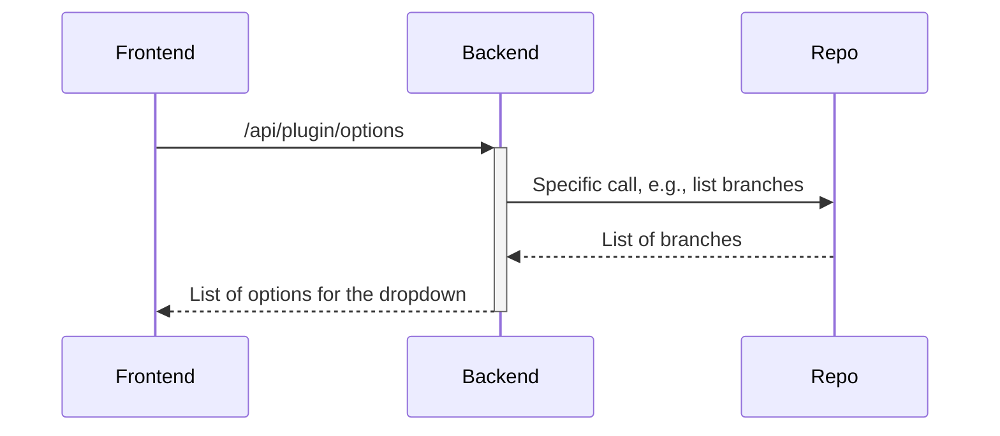
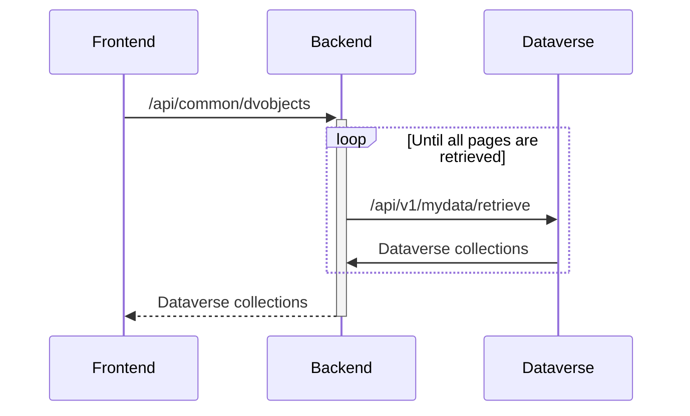
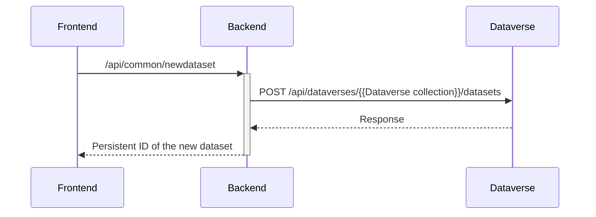
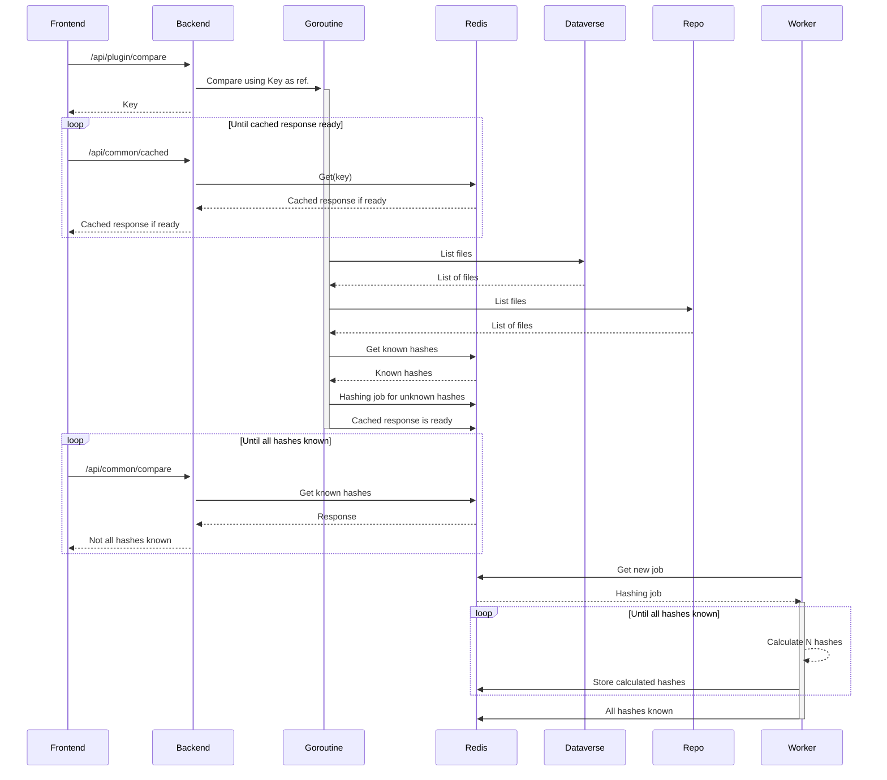
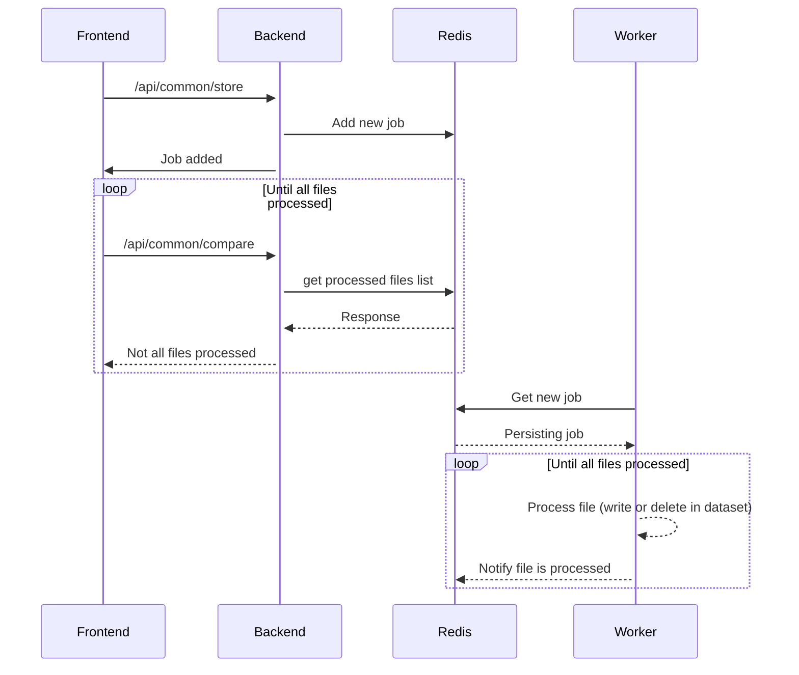

# rdm-integration


This is an application for files synchronization from different source repositories into a [Dataverse](https://dataverse.org) installation. This application uses background processes for the synchronization of the files. The background processes are also used for hashing of the Dataverse files when the source repository uses different hash type than the Dataverse installation. These hashes are needed for the comparison of the files, allowing easier versioning of the files between the dataset versions (only the files that effectively have changed would be replaced and added to the overview of changes between different dataset versions). The frontend application does not need to be running when the synchronization is running on the server (users can close their browsers once that the synchronization has been set up), and multiple synchronizations for different users can run simultaneously, each on its own goroutine, scheduled as a "job" in the background. The number of simultaneously running jobs is adjustable, and the jobs are scheduled in "First In First Out" order.

## Key Features

### Data Synchronization
Synchronize files from various repositories into Dataverse with background processing, hash verification, and version tracking.

### DDI-CDI Metadata Generation
Automatically generate rich, standardized metadata descriptions for your tabular data files following the DDI-CDI (Data Documentation Initiative - Cross-Domain Integration) specification. The feature analyzes CSV, TSV, SPSS, SAS, and Stata files to create comprehensive documentation including variable types, roles, statistics, and relationships. See [ddi-cdi.md](ddi-cdi.md) for complete documentation.
Need the external Dataverse tool or a quick start? The dedicated guide in [ddi-cdi.md](ddi-cdi.md#dataverse-external-tool-quick-start) covers the `make up` bootstrapping flow, demo credentials, and manual re-registration, while this README dives into the broader environment setup.

### High‑performance Globus transfers
Move data reliably and at scale using Globus. The built‑in Globus plugin supports both uploads and downloads via managed Globus transfers for S3‑backed storage, making it easy to bring large datasets into Dataverse or export them out of S3 storage. A dedicated download component provides a streamlined flow for large file retrieval via Globus and can be wired as a separate Dataverse external tool; it uses the same backend Globus integration.

## Globus Integration Details

This section provides a technical overview of the Globus integration, including capabilities, limitations, and how it differs from the official `dataverse-globus` app.

### Feature Comparison

| Feature | rdm-integration | dataverse-globus app |
|---------|-----------------|----------------------|
| **Authentication** | | |
| Globus uploads to S3 storage | ✅ | ✅ |
| Globus downloads from S3 storage | ✅ | ✅ |
| Preview URL support (General) | ✅ **Unique** | ❌ |
| Preview URL support (Anonymous) | ❌ (Dataverse limitation) | ❌ |
| Guest download (public datasets) | ✅ | ❌ |
| Authenticated user download | ✅ | ✅ |
| Globus OAuth | Redirect with client secret | PKCE (v2 branch) |
| Dataverse auth | Shibboleth / OIDC | Signed URLs |
| **Scoped Institutional Login** | | |
| `session_required_single_domain` support | ✅ | ❌ |
| Access to institutional endpoints (e.g., HPC) | ✅ (for logged-in users) | ❌ |
| Scope removal for guest/preview access | ✅ (automatic) | N/A |
| **Transfer Monitoring** | | |
| Real-time transfer progress polling | ✅ | ❌ |
| Progress percentage display | ✅ | ❌ |
| Transfer status in UI | ✅ (ACTIVE/SUCCEEDED/FAILED) | ❌ |
| Link to Globus web app for monitoring | ✅ | ✅ |
| **User Interface** | | |
| Hierarchical tree view for files | ✅ (PrimeNG TreeTable) | Flat list |
| Color-coded file selection | ✅ (CSS variables for light/dark) | ❌ |
| Folder selection (select all children) | ✅ | ❌ |
| Toggle all files at once | ✅ | ✅ (checkbox) |
| Destination folder tree navigation | ✅ (expandable tree) | ✅ (list navigation) |
| Multiple endpoint search tabs | ❌ | ✅ (Personal/Recent/Search) |
| DOI dropdown with search | ✅ | ❌ (passed via callback) |
| **Maintenance** | | |
| Active development | ✅ | ⚠️ (last commit 2+ years ago) |
| Latest Angular version | ✅ (Angular 19+) | Angular 17 (v2 branch) |
| Regular security updates | ✅ | ❌ |

### Preview URL Support

This integration supports **General Preview URLs** for Globus downloads from draft datasets. This enables:
- Reviewers to download draft dataset files via Globus
- Collaborators without Dataverse accounts to access data
- External validators to retrieve files before publication

**Important**: **Anonymous Preview URLs are NOT supported** due to Dataverse's `ApiKeyAuthMechanism` which blocks anonymized tokens from accessing Globus APIs. This is a Dataverse security feature for blind peer review.

See [preview_urls.md](preview_urls.md) for complete technical documentation.

### Scoped Institutional Login

When configured with `session_required_single_domain` (e.g., `kuleuven.be`), logged-in users are required to authenticate with their institutional identity at Globus. This enables access to institutional Globus endpoints such as:

- HPC storage endpoints
- Research group shared storage
- Institutional data repositories

**For guest and preview URL users**, the scope restriction is automatically removed, allowing them to use any Globus identity (personal or institutional) to complete the transfer.

```
Globus OAuth URL for logged-in users:
https://auth.globus.org/v2/oauth2/authorize?scope=...&session_required_single_domain=kuleuven.be

Globus OAuth URL for guest/preview users (scope stripped):
https://auth.globus.org/v2/oauth2/authorize?scope=...
```

### Transfer Progress Monitoring

The download component includes real-time transfer progress monitoring:

- **Automatic polling**: Status checked every 5 seconds while transfer is active
- **Progress bar**: Shows percentage complete based on bytes transferred
- **Status display**: ACTIVE → SUCCEEDED/FAILED/CANCELED
- **External link**: Direct link to Globus web app for detailed monitoring
- **Completion callback**: UI updates automatically when transfer finishes

### How It Works

Unlike the official `dataverse-globus` app which relies on Dataverse's signed URL mechanism, this integration:

1. **Extracts** the preview token from the URL provided by the user
2. **Passes** the token to the backend as a Dataverse API key
3. **Calls** Dataverse APIs directly with `X-Dataverse-key: {previewToken}`

This bypasses the signed URL limitation where preview users (who are virtual `PrivateUrlUser` objects not stored in the database) cannot have signed URLs generated for them.

### Authentication Flow

```
┌──────────────────────────────────────────────────────────────────────┐
│  1. User clicks "Globus Download" in Dataverse                       │
│     └─→ Callback URL contains datasetDbId and downloadId             │
│                                                                      │
│  2. User sees login options popup:                                   │
│     ├─ "Continue as guest" (public files only)                       │
│     ├─ "Continue with preview URL" ← pastes General Preview URL      │
│     └─ "Log in" (institutional SSO)                                  │
│                                                                      │
│  3. Token extracted from preview URL and preserved in OAuth state    │
│                                                                      │
│  4. User authenticates with Globus (OAuth redirect)                  │
│                                                                      │
│  5. Backend receives: Globus token + Dataverse preview token         │
│     └─→ Calls Dataverse APIs with preview token                      │
│     └─→ Initiates Globus transfer with Globus token                  │
└──────────────────────────────────────────────────────────────────────┘
```

### Limitations

| Limitation | Reason | Workaround |
|------------|--------|------------|
| Anonymous Preview URLs don't work | Dataverse blocks anonymized tokens for Globus APIs | Use General Preview URL |
| Preview users can't use signed URLs | `PrivateUrlUser` not in database, no `ApiToken` | Direct API calls with token |
| Requires Globus app registration | OAuth flow needs client ID and secret | Register at auth.globus.org |

### Configuration

Globus plugin configuration in `backend_config.json`:

```json
{
  "plugins": [
    {
      "id": "globus",
      "plugin": "globus",
      "tokenGetter": {
        "authURL": "https://auth.globus.org/v2/oauth2/authorize",
        "oauth_client_id": "YOUR_GLOBUS_CLIENT_ID"
      }
    }
  ]
}
```

The client secret is stored separately in the OAuth secrets file (see `pathToOauthSecrets` in backend configuration).

## Available plugins
Support for different repositories is implemented as plugins. More plugins will be added in the future. At this moment, the following plugins are provided with the latest version:
- [GitHub](https://github.com/)
- [GitLab](https://about.gitlab.com/)
- [IRODS](https://irods.org/)
- [Dataverse](https://dataverse.org/) (use other Dataverse as source to import the data)
- [Microsoft OneDrive / SharePoint Online](https://learn.microsoft.com/graph/overview) — same Microsoft Graph integration; SharePoint is enabled via configuration of the OneDrive plugin (no separate plugin needed)
- [OSF](https://osf.io/)
- [SFTP](https://en.wikipedia.org/wiki/SSH_File_Transfer_Protocol)
- [REDCap](https://projectredcap.org/)
- [Globus](https://www.globus.org/) — upload and download using Globus transfers (S3‑backed storage)
- Local filesystem — synchronize from a local folder accessible to the server

## Getting started

Prerequisite: ensure that Docker (with the Compose plugin) **and** GNU Make are installed and available on your PATH - the `make up` target spins up the full stack via `docker compose`. The stack exposes supporting services on loopback-friendly hostnames (`keycloak.localhost`, `localstack.localhost`, `minio.localhost`), so no `/etc/hosts` edits are required.

You can start the demo with the following command (requires Docker):

```shell
make up
```

Once services are up (watch the terminal output), you can use the application directly — no Dataverse external‑tool setup required:

- Visit the web app: http://localhost:4180
- Jump straight to the DDI‑CDI generator: http://localhost:4180/ddi-cdi
- You can also create datasets, synchronize files, and explore plugins from the app's UI.

Key URLs during local development:

- http://localhost:4180 — RDM‑integration web app (behind OAuth2 Proxy)
- http://localhost:4180/download - Globus download component (dedicated large‑file download flow)
- http://localhost:8080 — Dataverse UI
- http://localhost:8090 — Keycloak admin console (realm `test`, admin user `kcadmin` / `kcpassword`)

### Use from Dataverse (optional)

Wait until everything is initialized and started (follow the status in the terminal output). Then open [http://localhost:8080](http://localhost:8080) and click `Log In`. Choose `OpenID Connect`, then click `Log In with OpenID Connect`. Sign in with the demo user (`admin` / `admin`):


Complete the new user form by choosing a username and by agreeing to the terms:


### Default credentials

- **Application login via OIDC (realm user)**: `admin / admin` (use this to sign in to the app and Dataverse via OpenID Connect)
- **Keycloak admin console**: `kcadmin / kcpassword` (for managing the `test` realm at http://localhost:8090)
- **Dataverse built-in admin user**: username `dataverseAdmin`, password `secret-admin-password` (value stored in `docker-volumes/dataverse/secrets/password`)
- **Dataverse built-in admin API key**: available inside the container at `/run/secrets/api/adminkey` after startup

After creating that new account, go to the `API Token` menu option:


Create a new token and go back to the main page to create a new dataset:


Fill out the form and click on `Save Dataset`. In the new dataset choose the `RDM-integration upload` option from the `Edit Dataset` menu (the stack auto-registers this external tool for convenience):


Agree to the popups from the localhost, you will be redirected to log in:


After logging in, you can test different plugins and scenarios. You can also go directly to the RDM-integration tool [http://localhost:4180](http://localhost:4180) to initiate different use-cases, e.g., creating new empty dataset with the `Create new dataset` button:


### Dataverse external tools

The stack includes Dataverse external tool configurations that point to dedicated routes in the application. These are copied from `conf/dataverse/external-tools/` during bootstrap and can be adapted to your environment:

- RDM‑integration download (type: `explore`, scope: `dataset`) — dedicated Globus download component
    - Route: `/download`
    - Config: `conf/dataverse/external-tools/01-rdm-integration-download.json`
- RDM‑integration upload (type: `configure`, scope: `dataset`) — connect/sync workflow
    - Route: `/connect`
    - Config: `conf/dataverse/external-tools/02-rdm-integration-upload.json`
- Generate DDI‑CDI (type: `configure`, scope: `dataset`) — launch the DDI‑CDI generator
    - Route: `/ddi-cdi`
    - Config: `conf/dataverse/external-tools/03-rdm-integration-ddi-cdi.json`

### Stop and reset

- Stop the stack:

```shell
make down
```

- Reset local volumes (removes data) and re-initialize:

```shell
make clean
make init
```

## Fast redeploy targets

When you are working with the development stack started via `make dev_up`, you can rebuild individual services without repeating the full bootstrap. The `make frd-integration` and `make frd-dataverse` targets handle those focused redeploys and include safety checks to ensure the dev stack is running (the `make dev_up` command drops a sentinel file that the redeploy targets verify before proceeding). Make sure the sibling repositories are cloned beside this project:

- `https://github.com/IQSS/dataverse` → `../dataverse`
- `https://github.com/libis/rdm-integration-frontend` → `../rdm-integration-frontend`

Once the stack is up, the integration container runs `ng serve` against `../rdm-integration-frontend`; saving Angular files triggers live recompiles that are served through the OAuth proxy on `http://localhost:4180/`, so UI changes appear without additional targets. Use `make frd-integration` when the Go backend or container config needs a restart.

Then follow [FAST_REDEPLOY.md](FAST_REDEPLOY.md) for the full workflow.

## Configuration overview

The application loads its runtime configuration from two files, passed via environment variables and mounted by Docker Compose:

- Backend: `BACKEND_CONFIG_FILE` → `/config/backend_config.json`
- Frontend: `FRONTEND_CONFIG_FILE` → `/config/frontend_config.json`

Source templates for both live in `conf/`:

- `conf/backend_config.json`
- `conf/frontend_config.json`

The `make init` target copies these files into `docker-volumes/integration/conf/`, which is mounted into the container at `/config` by `docker-compose.yml`. It also stages related configs like `conf/oauth2-proxy.cfg` to `docker-volumes/integration/conf/oauth2-proxy.cfg`, which the container uses at runtime.

To customize settings, either edit the files under `conf/` and run `make init` (fresh volumes), or change the copies in `docker-volumes/integration/conf/` and restart the stack (`make down && make up`).

## Prerequisites
For building the frontend, you need to have [Angular CLI](https://github.com/angular/angular-cli) installed. You will need to have the latest [Go](https://go.dev/) installed for compiling the code. If you wish to build the application's container, you will need to have the [Docker](https://www.docker.com) installed. Finally, the state of the application (calculated hashes, scheduled jobs, etc.) is maintained by a [Redis](https://redis.io/) data store. When running this application on the server, you will need either access to an external Redis server, or one run by you locally. The stand-alone tool does not require any Redis server (or any other tool or library installed on your system), and can be simply run by executing a binary built for your operating system.

## Dependencies
This application can be used by accessing the API directly (from cron jobs, etc.), or with a frontend providing GUI for the end users. The frontend source code can be found here: ([rdm-integration-frontend](https://github.com/libis/rdm-integration-frontend)). Besides the frontend dependency, the build process use the following libraries and their dependencies (``go build`` command resolves them from ``go.mod`` and ``go.sum`` files, and they do not need to be installed separately):
- [AWS SDK for Go v2](https://github.com/aws/aws-sdk-go-v2)
- [Redis client for Go](https://github.com/go-redis/redis)
- [go-github](https://github.com/google/go-github)
- [uuid](https://github.com/google/uuid)
- [OAuth2 for Go](https://golang.org/x/oauth2)

## Backend configuration
The backend configuration is loaded by the application from a file specified by the path stored in the ``BACKEND_CONFIG_FILE`` environment variable. In order to set a value for that variable, you will need to export that variable to the OS running the application, e.g.:
```
export BACKEND_CONFIG_FILE=../conf/backend_config.json
```

Note that the stand-alone version does not need the backend configuration file and is configured by the ``-X`` ldflags passed to the build command. You can also override these flags by adding arguments to the execution command, as described in the sections above.

An example of backend configuration can be found in [backend-config.json](conf/backend_config.json). Another example, as can be used to connect to the [Demo Dataverse](https://demo.dataverse.org), can be found in [backend_config_demo.json](conf/backend_config_demo.json). The ``BACKEND_CONFIG_FILE`` environment variable specifies which configuration file will be loaded. The only two mandatory fields in the configuration file are the following:
- dataverseServer: URL of the server where Detaverse API is deployed.
- redisHost: the host containing the Redis data store (storing the application state).

Additionally, the configuration can contain the following fields in the optional "options" field:
- dataverseExternalUrl: this field is used to generate a link to the dataset presented to the user. Set this value if it is different from dataverseServer value, otherwise you can omit it.
- rootDataverseId: root Dataverse collection ID, needed for creating new dataset when no collection was chosen in the UI.
- defaultHash: as mentioned earlier, "MD5" is the default hash for most Dataverse installations. Change this only when your installation uses a different hashing algorithm (e.g., SHA-1).
- myDataRoleIds: role IDs for querying my data, as explained earlier in this section.
- pathToUnblockKey: path to the file containing the API unblock key. Configure this value to enable checking permissions before requesting jobs.
- pathToApiKey: path to the file containing the admin API key. Configure this value to enable url signing i.s.o. using the users Dataverse API tokens.
- pathToRedisPassword: by default no password is set, if you need to authenticate with Redis, store the path to the file containing the Redis password in this field.
- redisDB: by default, DB 0 is used. If you need to use another DB, specify it here.
- defaultDriver: default driver as used by the Dataverse installation, only "file" and "s3" are supported. See also the next section.
- pathToFilesDir: path to the folder where Dataverse files are stored (only needed when using the "file" driver).
- s3Config: configuration when using the "s3" driver, similar to the settings for the s3 driver in your Dataverse installation. Only needed when using S3 file system that is not mounted as a volume. See also the next section.
- pathToOauthSecrets: path to the file containing the OATH client secrets and POST URLs for the plugins configured to use OAuth for authentication. An example of a secrets file can be found in [example_oath_secrets.json](conf/example_oath_secrets.json). As shown in that example, each OAuth client has its own entry, identified by the application ID. Each entry contains two fields: clientSecret containing the client secret, and postURL containing the URL where the post request for acquiring tokens should be sent to. See the frontend configuration section for information on configuration of OAuth authorization for the plugins.
- maxFileSize: maximum size of a file that can be uploaded to the Dataverse installation. When not set, or set to 0 (or value less than 0), there is no limit on file size that can be uploaded. The files that cannot be uploaded due to the file size limit are filtered out by the frontend and the user is notified with a warning.
- userHeaderName: URL signing needs the username in order to know for which user to sign, the user name should be passed in the header of the request. The default is "Ajp_uid", as send by the Shibboleth IDP.
- smtpConfig: configure this when you wish to send notification emails to the users: on job error and on job completion. For example, the configuration could look like this:
```
"smtpConfig": {
  "host": "smtp.gmail.com",
  "port": "587",
  "from": "john.doe@gmail.com"
},
"pathToSmtpPassword": "/path/to/password/file"
```
- pathToSmtpPassword: path to the file containing the password needed to authenticate with the SMTP server

### Dataverse file system drivers
When running this tool on the server, you can take the advantage of directly uploading files to the file system where Dataverse files are stored (assuming that you have direct access to that file system from the location where this application is running). The most generic way is simply mounting the file system as a volume and configuring the application (in the backend configuration file) to use the "file" driver pointing to the mounted volume. For example:

```
{
    "dataverseServer": "https://some.dataverse.com",
    "redisHost": "localhost:6379",
    "options": {
        "dataverseServer": "https://some.dataverse.com",
        "defaultDriver": "file",
        "pathToFilesDir": "/path/to/mounted/volume"
    }
}
```

As an alternative, you can access an s3 storage directly from this application, without the need of mounting it. First, you will need to configure the authentication by setting the following environment variables on the OS running this application:
- Access Key ID: ``AWS_ACCESS_KEY_ID`` or ``AWS_ACCESS_KEY``
- Secret Access Key: ``AWS_SECRET_ACCESS_KEY`` or ``AWS_SECRET_KEY``

The s3 driver is then configured in the backend configuration file, for example:
```
{
    "dataverseServer": "localhost:8080",
    "redisHost": "localhost:6379",
    "options": {
        "dataverseExternalUrl": "https://demo.dataverse.org",
        "defaultDriver": "s3",
        "s3Config": {
            "awsEndpoint": "http://some.endpoint.here",
            "awsRegion": "region",
            "awsPathstyle": "true",
            "awsBucket": "bucket"
        }
    }
}
```

Notice that the driver configuration is optional. When it is not set, no direct uploading is in use and simply the Dataverse API is called for storing the files. However, this can result in unnecessary usage of resources (network, CPU, etc.) and might slow down the Dataverse installation.

## Frontend configuration
There are two types of possible customizations to the frontend. The first type is the customization done by the replacement of the HTML files, e.g., the [footer.html](conf/customizations/assets/html/footer.html) and the [header.html](conf/customizations/assets/html/header.html). The files that are going to be replaced are placed in the [conf/customizations](conf/customizations/) directory, that can also contain the files referenced by the custom HTML files. By default, only the ``make executable`` and ``make multiplatform_demo`` commands effectively replace these files while building. In order to add customizations into your make script, add the following line to the script: ``cp -r conf/customizations/* image/app/frontend/dist/datasync/``.

The second type is the configuration with a configuration file. The default configuration file (used when the configuration file is not specified in the ``FRONTEND_CONFIG_FILE`` environment variable) can be found in [default_frontend_config.json](image/app/frontend/default_frontend_config.json). In order to use a custom configuration file, set the ``FRONTEND_CONFIG_FILE`` environment variable accordingly. An example of the configuration file, also used by the make scripts and the docker commands, can be found in [frontend_config.json](conf/frontend_config.json).

The configuration file can contain the following options for the frontend:
- dataverseHeader: the display name of the Dataverse installation.
- collectionOptionsHidden: if set to ``false`` (or omitted), an extra dropdown is shown that allows for collection selection within the Dataverse installation. The selected installation is then used for creating new dataset, when that option is enabled, and for filtering of the available datasets.
- collectionFieldEditable: if set to ``true``, the user can paste or type collection identifiers directly, without the use of the dropdown.
- createNewDatasetEnabled: if set to ``true``, it enables the "Create new dataset" button.
- datasetFieldEditable: if set to ``true``, the user can paste or type DOI identifiers directly, without the use of the dropdown.
- externalURL: this option if filled out by the backend from the ``dataverseExternalUrl`` backend configuration file field, and should not be set manually.
- showDvTokenGetter: set it to ``true`` to show the "Get token" button next to the Dataverse token field.
- showDvToken: set it to ``true`` to show the token field (set it to ``false`` when using URL signing).
- redirect_uri: when using OAuth, this option should be set to the ``redirect_uri`` as configured in the OAuth application setting (e.g., GitHub application settings as described in this [guide](https://docs.github.com/en/developers/apps/building-github-apps/identifying-and-authorizing-users-for-github-apps)). The redirect URI must point to the ``/connect`` page of this application.
- sendMails: set it to ``true`` to enable sending mails to the user (you need to configure smtp settings in the backend configuration).
- plugins: contains one entry for each repository instance, as described below.

Having multiple instances for plugin types is useful when certain features, e.g., OAuth authentication, can be configured for specific installations of a given repository type. It is perfectly possible to have at most one instance for each plugin type, as it is the case in the [default_frontend_config.json](image/app/frontend/default_frontend_config.json). Plugins that er not configured will not be shown in the UI. The repository instance, configured as an entry in ``plugins`` setting of the frontend configuration, can contain the following fields:
- id: unique identifier for the repository instance configuration.
- name: name of the instance, as displayed in the "Repository instance" field on the connect page, e.g. "KU Leuven GitLab".
- plugin: the identifier of the plugin, as implemented in [registry.go](image/app/plugin/registry.go), e.g., ``irods``, ``github``, ``gitlab``, etc.
- pluginName: Display name of the plugin, as displayed in the "Repository type" dropdown.
- optionFieldName: when the plugin implements ``Options`` function, this field is set to the name of the implemented option, e.g., "branch" or "folder".
- optionFieldPlaceholder: the placeholder for option field.
- tokenFieldName: when the user needs to authenticate with a API token or password to the given repository (e.g., OAuth is not configured for this repository instance), this field should be set to the name of the needed credential, e.g., "Token" or "Password"
- tokenFieldPlaceholder: the placeholder for the token field.
- sourceUrlFieldName: when configured, the UI will show the source URL field, where the user can enter the URL of the repository to connect to.
- sourceUrlFieldPlaceholder: the placeholder for the source URL field.
- sourceUrlFieldValue: when configured, it contains the default value for the source URL field. When this value is always the same for a given plugin, e.g., ``https://github.com``, then the sourceUrlFieldName can be left empty, and the field will not be shown (but will always contain the configured default value). 
- usernameFieldName: when the user needs to authenticate with a username to the given repository (e.g., OAuth is not configured for this repository instance), this field should be set to the name of this field, e.g., "Username"
- usernameFieldPlaceholder: the placeholder for the username field.
- repoNameFieldName: repository selection field name.
- repoNameFieldPlaceholder: the placeholder for the repository selection field.
- repoNameFieldEditable: if set to ``true``, the user can paste or type repository name directly, without the use of the dropdown.
- repoNameFieldValues: suggested or possible repository names. When this is filled out, a dropdown will be presented to the user, otherwise a text field will be presented.
- repoNameFieldHasSearch: when the plugin implements ``Search`` function, this field can be set to ``true`` for searchable repository names.
- repoNameFieldHasInit: when the plugin implements ``Search`` function, this field can be set to ``true`` for initial search without the search term (initializes the dropdown to the default values as implemented by the search function).
- parseSourceUrlField: when set to true, the repoName field can be left not configured and the repository name is parsed from the source URL field.
- tokenName: when set to a unique value, the credential needed for authentication is stored in the browser.
- tokenGetter: OAuth configuration for the repository instance containing the URL where authorizations should be redirected to, and the oauth_client_id from the OAuth application setting (e.g., GitHub application settings as described in this [guide](https://docs.github.com/en/developers/apps/building-github-apps/identifying-and-authorizing-users-for-github-apps)). See also the backend configuration section on how to configure the needed client secrets.

## Writing a new plugin
In order to integrate a new repository type, you need to implement a new plugin for the backend. The plugins are implemented in the [image/app/plugin/impl](image/app/plugin/impl) folder (each having its own package). The new plugin implementation must be then registered in the [registry.go](image/app/plugin/registry.go) file. As can be seen in the same file, a plugin implements functions that are required by the Plugin type:
```
type Plugin struct {
	Query   func(ctx context.Context, req types.CompareRequest, dvNodes map[string]tree.Node) (map[string]tree.Node, error)
	Options func(ctx context.Context, params types.OptionsRequest) ([]string, error)
	Search  func(ctx context.Context, params types.OptionsRequest) ([]string, error)
	Streams func(ctx context.Context, in map[string]tree.Node, streamParams types.StreamParams) (map[string]types.Stream, error)
}
```

Each plugin implements at leas these two functions:
- Query: using the standard fields as provided in the "types.CompareRequest" (username, API token, URL, etc.) this function queries the repository for files. The result is a flat mapping of files found on the repository to their paths. A file is represented by a "tree.Node" type containing the file name, file path, hash type and hash value, etc. Notice that it does not contain the file itself. The ``dvNodes`` parameters holds a copy of the nodes as present in the Dataset on the Dataverse installation (and can be ignored in most cases).
- Streams: files are synchronized using streams from the source repository to the file system, where each file has its own stream. This function implements "types.Stream" objects for the provided files (the "in" parameter contains a filtered list of files that are going to be copied from the repository). Notably, a "types.Stream" object contains a function for opening a stream to the provided file and a function to close that stream.

Additionally, the plugins can implement the following functions:
- Options: this function lists branches (or folders in the case of IRODS) applicable for the current repository. It can be only called when the user has provided the credentials needed to call the repository (this is verified at the frontend) and the repository name that the options will apply to. These credentials and the repository name are then provided in the "types.OptionsRequest" value. This function needs only to be implemented when this functionality is needed by the given type of the repository.
- Search: when implemented, this function can be used for searching repositories by name, based on the search term provided by the user. It makes the selection of the repository process easier for the users.

After implementing the above-mentioned functions on the backend, the plugin needs to be configured at the frontend. It becomes then selectable by the user, with the possibility of different configurations for the specific repositories instances. See the section on frontend configuration for further details.

## Appendix: sequence diagrams

### Get options
The sequence diagrams for ``search`` and ``oauthtoken`` are very similar to this one, and are not shown separately.



### Get dataverse objects



### Create new dataset



### Compare files



### Store changes


# Architecture


