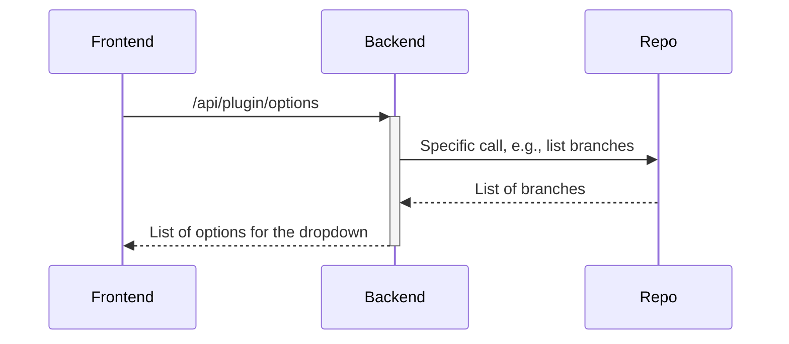
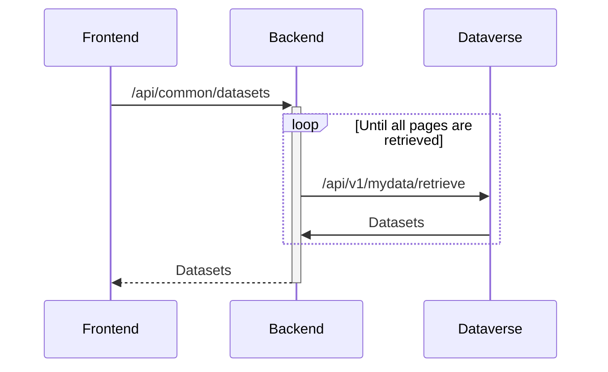
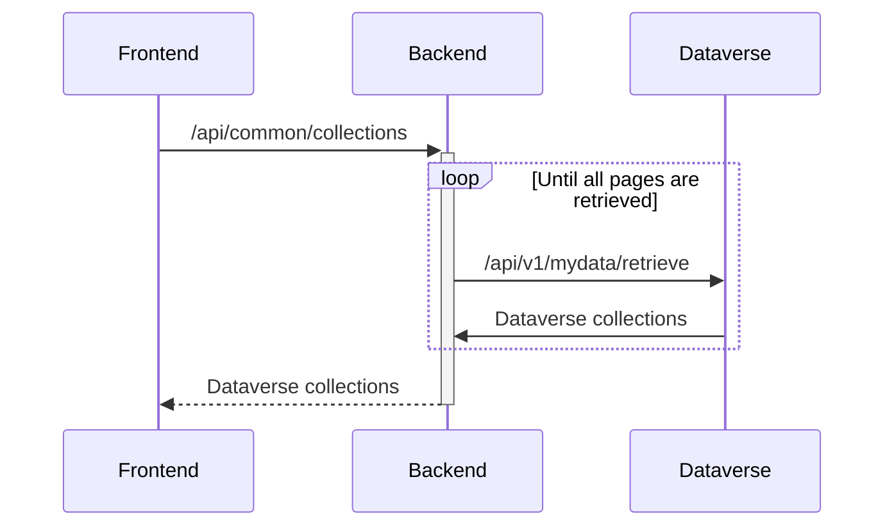
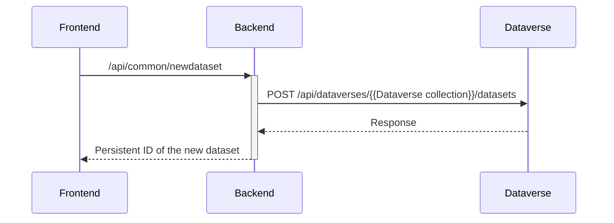
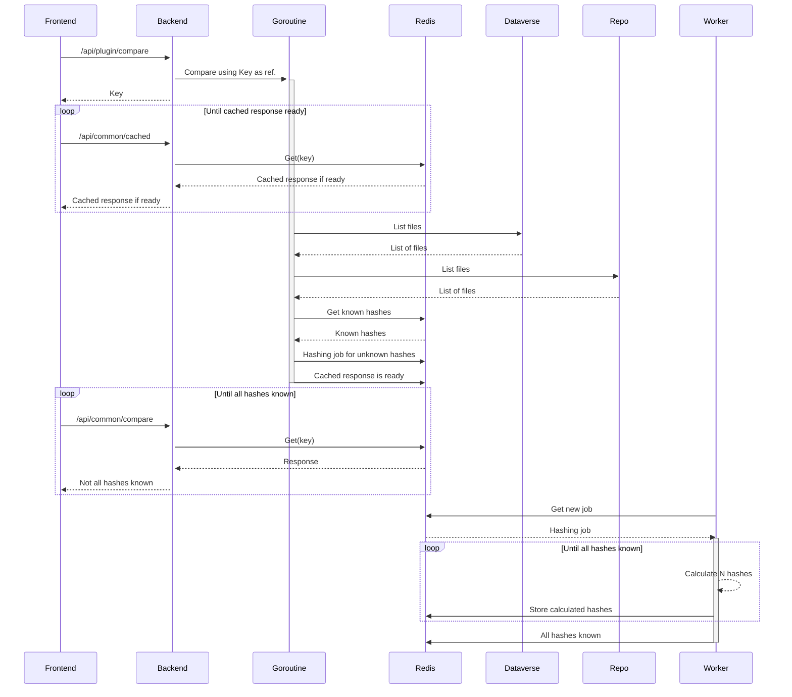

# rdm-integration
This is a work in progress and at this point only for GitHub, GitLab and Irods integration into the Dataverse (other systems will be added as work progresses).

With this application, files can be synchronized between different source repositories and a Dataverse repository. The application uses background processes for the synchronization of the files, as well as, for hashing of the local files when the source repository uses different hash type from Dataverse. The hashes are then used for the comparing of the files. The frontend application does not need to be running when the synchronization is running on the server, and multiple synchronizations for different users can run simultaneously, each on its own go-routine.

## Prerequisites
For building the frontend, you need to have [Angular CLI](https://github.com/angular/angular-cli) installed. If you want to run the application locally without the Docker containers, you will need to have the latest Go installed. If you wish to build the application's container, you will need to have the Docker installed.

## Running the application
In order to run the application locally, checkout in the same folder this repository (rdm-integration from https://github.com/libis/rdm-integration) and the frontend (rdm-integration-frontend from https://github.com/libis/rdm-integration-frontend). Then go to /rdm-integration and run "make run". Notice that if you do not run standard Libis rdm (Dataverse) locally, you will need to define environment variables as defined in /image/app/env.go

You can also use make commands to build the docker image (make build) or push to the docker repository (make push).

In order to redeploy the integration application on pilot/prod (after building with make build with env set to prod):
- ssh to the server
- make pull
- make stop-integration
- make up

## Writting a new plugin
In order to integrate a new repository type, you need to implement a new plugin for the backend. The plugins are implemented in the /image/app/plugin/impl folder (each having its own package). The new plugin implementation must be then registered in the /image/app/plugin/registry.go file. As can be seen in the same file, a plugin implements functions that are required by the Plugin type:
```
type Plugin struct {
	Query   func(req types.CompareRequest) (map[string]tree.Node, error)
	Options func(params types.OptionsRequest) ([]string, error)
	Streams func(ctx context.Context, in map[string]tree.Node, streamParams types.StreamParams) (map[string]types.Stream, error)
}
```

Note that the Plugin type is a struct and cannot hold any state, as it has no fields. Therefore, the plugin implementations are stateless and all state, caching, etc., are handled by the application, independently of the used plugin. This makes the plugins easier to implement. Each plugin implements these tree functions:
- Query: using the standard fields as provided in the "types.CompareRequest" (username, api token, URL, etc.) this function queries the repository for files. The result is a flat mapping of files found on the repository to their paths. A file is represented by a "tree.Node" type containing the file name, file path, hash type and hash value, etc.
- Options: this function lists branches (or folders in the case of IRODS, this is also the reason for choosing a more generic name "options" i.s.o. "branches") applicable for the current repository. It can be only called when the user has provided the credentials needed to call the repository. These credentials are then provided in the "types.OptionsRequest" value.
- Streams: files are synchronized using streams from the source repository to the filesystem, where each file has its own stream. This function implements "types.Stream" objects for the provided files (the "in" parameter contains a filtered list of files that are going to be copied from the repository). Notably, a "types.Stream" object contains a function for opening a stream to the provided file and a function to close that stream.

After implementing the above-mentioned functions on the backend, you need to extend the frontend (https://github.com/libis/rdm-integration-frontend) by adding a frontend plugin in "plugin.service.ts". This is a straight forward implementation of the RepoPlugin type as defined in the "plugin.ts" model. It basically tells the frontend that there is a new repository type, which field should be shown on the connect page and how these fields should be named, etc., for the given repository type.

## Sequence diagrams

### Get options
Listing branches, folders, etc. (depending on the repo plugin) that can be chosen in dropdown and on the connect page is a synchronous call. When retrieved, a branch or folder can be selected by the user as reference from where the files will be synchronized. The listing itself is implemented by a plugin and is described in the following sequence diagram:



### Get datasets
Another dropdown on the connect page lets the user to specify to which dataset the files should be synchronized. This is also a synchronous call and the dropdown displays "Loading..." (the same is true for the get options call) until a response is recived from the backend. The backend uses the Dataverse /api/v1/mydata/retrieve api call and retrieves all pages in a loop (the call supports paging for the cases where the user has many datasets). This is depicted in the diagram below:



### Get dataverse collections




### Create new dataset




### Compare files




### Store changes
/api/common/store
