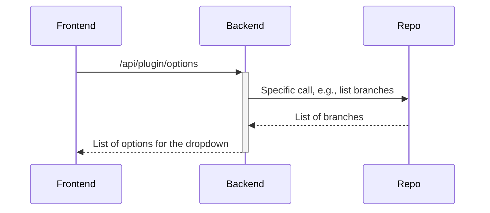
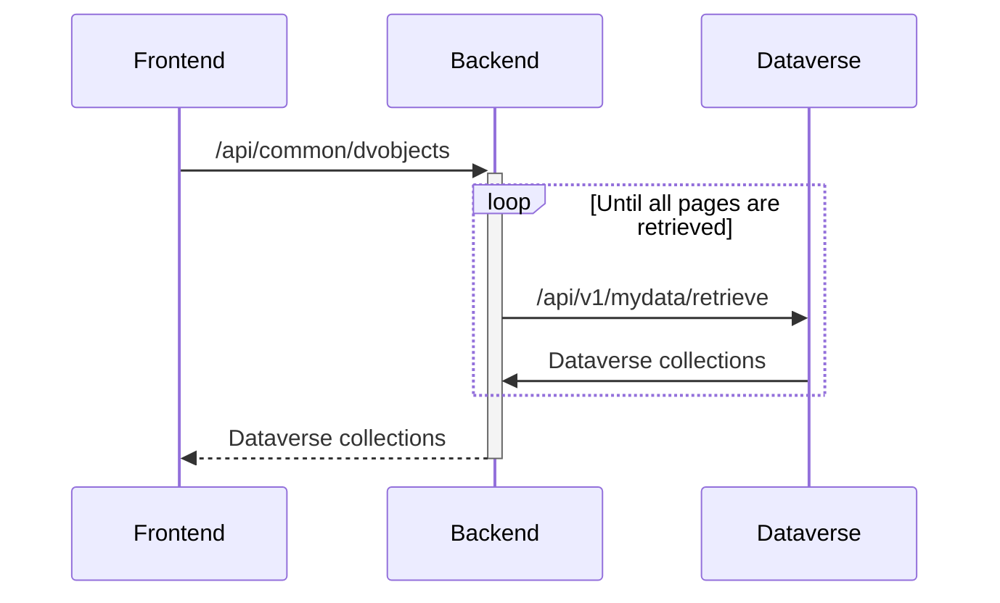
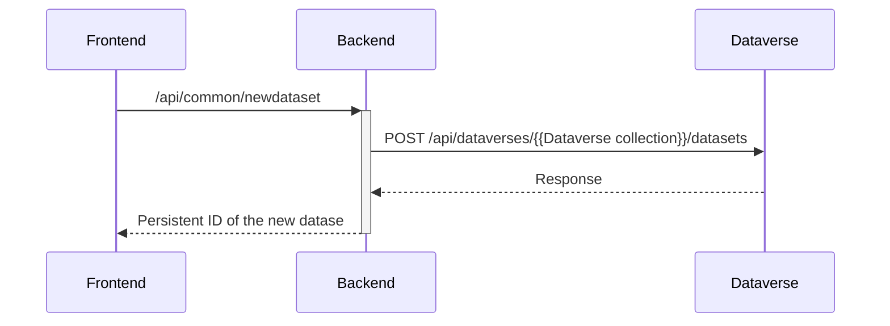
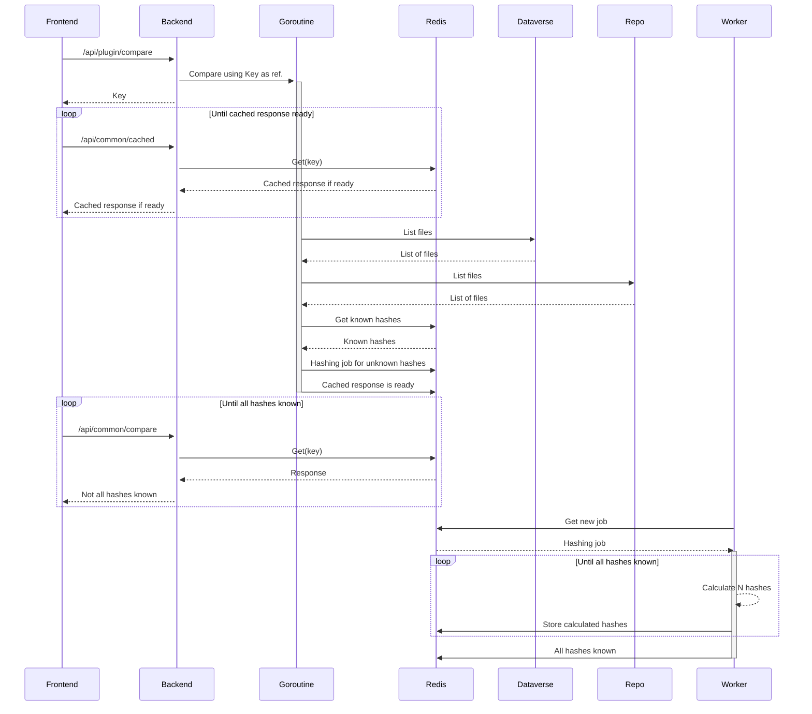
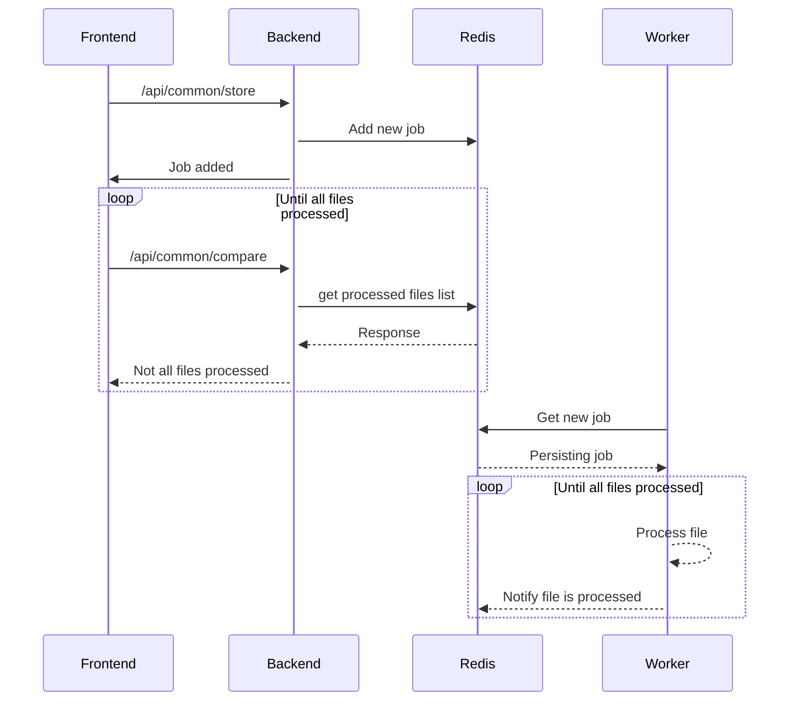

# Dataverse files synchronization application
This is an application for files synchronization from different source repositories into a [Dataverse](https://dataverse.org) installation. This application uses background processes for the synchronization of the files. The background processes are also used for hashing of the Dataverse files when the source repository uses different hash type than the Dataverse installation. The hashes are then used for the comparing of the files, allowing easier versioning of the files between the dataset versions (only the files that effectively have change would be replaced and added to the overview of changes between different dataset versions). The frontend application does not need to be running when the synchronization is running on the server (users can close their browsers once that the synchronization has been set up), and multiple synchronizations for different users can run simultaneously, each on its own go-routine, scheduled as a "job" in the background. The number of simultaneously running jobs is adjustable, and the jobs are scheduled in First-In-First-Out (FIFO) order.

This application can also be used as a stand-alone tool for uploading and synchronizing files from local storage to the Dataverse installation. Only the stand-alone tool allows synchronizing files from your local file system to a Dataverse installation. All other plugins (synchronizing from [GitHub](https://github.com/), [GitLab](https://about.gitlab.com/), [IRODS](https://irods.org/), etc.) are the same in the stand-alone and server versions.

## Available plugins
Support for different repositories is implemented as plugins. More plugins will be added in the feature. At this moment, the following plugins are provided with the latest version:
- local storage (available only in the stand-alone version)
- [GitHub](https://github.com/)
- [GitLab](https://about.gitlab.com/)
- [IRODS](https://irods.org/)

## Getting started
Download the binary built for your system (Windows, Linux or Darwin/macOS on intel or arm64 architecture) from the latest release and execute it by double-clicking on it or by running it in command-line. By default, the application will connect to the [Demo Dataverse](https://demo.dataverse.org). If you wish to connect to a different Dataverse installation, run it in command-line with the ``server`` parameters set to the Dataverse installation of your choice, e.g., on Windows system:
```
demo_windows.exe -server=https://demo.dataverse.org
```

For more details, see the section about running the application.

## Prerequisites
For building the frontend, you need to have [Angular CLI](https://github.com/angular/angular-cli) installed. You will need to have the latest [Go](https://go.dev/) installed for compiling the code. If you wish to build the application's container, you will need to have the [Docker](https://www.docker.com) installed. For running and building the applications from source using the make commands, you will need to have [make](https://www.gnu.org/software/make/) installed. Finally, the state of the application (calculated hashes, scheduled jobs, etc.) is maintained by a [Redis](https://redis.io/) data store. When running this application on the server, you will need either access to an external Redis server, or one run by you locally. The stand-alone tool does not require any Redis server (or any other tool or library installed on your system), and can be simply run by executing a binary built for your operating system.

## Dependencies
This application can be used by accessing the API directly (from cron jobs, etc.), or with a frontend providing GUI for the end users. The frontend ([rdm-integration-frontend](https://github.com/libis/rdm-integration-frontend)) needs to be checked out separately prior to building this application. Besides the frontend dependency, the build process uses the following libraries and their dependencies (``go build`` command resolves them from ``go.mod`` and ``go.sum`` files, and they do not need to be installed separately):
- [AWS SDK for Go](https://github.com/aws/aws-sdk-go)
- [Redis client for Go](https://github.com/go-redis/redis)
- [go-github](https://github.com/google/go-github)
- [uuid](https://github.com/google/uuid)
- [OAuth2 for Go](https://golang.org/x/oauth2)

## Running the application
The most straight forward way of running the application is to use the in the release provided binaries. Note that these binaries are only meant to be used by the end users and should not be used on a server. If you wish to build your own binaries or build this application for running on a server, see the section on running and building from source.

By default, the tool connects to the [Demo Dataverse](https://demo.dataverse.org). If you wish to change the default configuration, you can execute the binary with -h argument. This will list the possible configuration options. For example, if you wish to connect to a different Dataverse installation, run it in command-line with the ``server`` and ``serverName`` (display name of the server as show in the UI, e.g. ``My Dataverse``) parameters set to the Dataverse installation of your choice, e.g., or example, you can run the executable with the following options: ``-server=https://your.dataverse.installation -serverName="Dataverse Installation"``. On Windows system, the full command looks like this (first change to the directory where the file is downloaded):
```
demo_windows.exe -server=https://your.dataverse.installation -serverName="Dataverse Installation"
```

You can also build your own binaries with different default values for the command-line arguments. See the next section for more detail (in the part about ``-X`` flags).

### Running and building from source
In order to run the application locally, checkout in the same folder, this repository ([rdm-integration](https://github.com/libis/rdm-integration)) and the frontend repository ([rdm-integration-frontend](https://github.com/libis/rdm-integration-frontend)). Then go to ``/rdm-integration`` directory and run ``make run``. This script will also start a docker container containing the Redis data store, which is used the by the running application for storing the application state. Notice that if you do not run standard Libis RDM (Dataverse) locally, you will need to configure the backend to connect to your Dataverse installation server. See the "Backend configuration" section for more detail.

You can also use make commands to build the docker image (``make build -e BASE_HREF='/'``) or push to the docker repository (``make push``). The resulting container can be used as a web server hosting the API and the frontend, or as a container running the workers executing the jobs scheduled by the frontend. For the purpose of scalability, both types of intended usage can have multiple containers running behind a load balancer. The default run command starts a container performing both tasks: a web server and a process controlling 100 workers:
```
docker run -v $PWD/conf:/conf --env-file ./env.demo -p 7788:7788 rdm/integration:1.0 app 100
```

After starting the docker container with the command above, verify that the web server is running by going to [http://localhost:7788](http://localhost:7788). If you wish to have different number of simultaneously running works, change 100 to the desired values. If you only wish the resulting container to function as a web server, change this command to the following:
```
docker run -v $PWD/conf:/conf --env-file ./env.demo -p 7788:7788 rdm/integration:1.0 app
```

When running the web server separately from the workers, you will need at least one container running the workers, started with the following command:
```
docker run -v $PWD/conf:/conf --env-file ./env.demo -p 7788:7788 rdm/integration:1.0 workers 100
```

Building binaries with local file system plugin, just as the binaries included in the release, meant only for running by the end users and not on a server, is also done with the make command: ``make executable``. You may want to adjust that script by setting the variables to make the application connect to your Dataverse installation. By default, the built application connects to the [Demo Dataverse](https://demo.dataverse.org). In order to change that, you must adapt the build command the following way (in the ``image`` directory):
```
go build -ldflags "-X main.DataverseServer=https://demo.dataverse.org -X main.RootDataverseId=demo -X main.DefaultHash=MD5" -v -o datasync.exe ./app/local/
```

These are the ``-X`` flags that you can set at the build time and set the default values for the command line arguments:
- DataverseServer (sets the default value for the ``server`` argument): URL of the Dataverse installation that the built application will connect to by default
- DataverseServerName (sets the default value for the ``serverName`` argument): display name of the Dataverse installation, e.g., "Demo Dataverse"
- RootDataverseId (sets the default value for the ``dvID`` argument): ID of the root Dataverse collection of the Dataverse installation, e.g., "demo"
- DefaultHash (sets the default value for the ``hash`` argument): most Dataverse installation use "MD5" as hashing algorithm, and this flag can be omitted in most cases. The only hash that is supported right now is the "SHA1".
- MyDataRoleIds (sets the default value for the ``roleIDs`` argument): this application uses the API call for retrieving "my data", for providing the user the choice of the dataset that the user wishes to update. However, this API requires the Role ID (primary key of the role table where the particular role is stored on the database), which can be tricky to find. Only the datasets where the user has that particular role are return by the server. If your Dataverse installation does not fill the dropdown for dataset choice, then this flag should be adjusted. Otherwise, you can omit this flag. The default setting is ``6,7`` representing the ``contributor`` and ``curator`` roles on most installations.

You can also build the binaries for multiple architectures at once with the ``make multiplatform_demo`` command. Adapt the build commands in that script similarly as described for the ``make executable`` command.

### Backend configuration
The backend configuration is loaded by the application from a file specified by the path stored in the ``BACKEND_CONFIG_FILE`` environment variable. In order to set a value for that variable, you will need to export that variable to the OS running the application, e.g.:
```
export BACKEND_CONFIG_FILE=../conf/backend_config.json
```

Note that the stand-alone version does not need the backend configuration file and is configured by the ``-X`` ldflags passed to the build command. You can also override these flags by adding arguments to the execution command, as described above.

The only two required fields that must be configured for the application to work are the following:
- dataverseServer: URL of the server where Detaverse API is deployed
- redisHost: the host containing the Redis data store (storing the application state)

Additionally, the configuration can contain the following fields in the optional "options" field:
- dataverseExternalUrl: used to generate a link to the dataset presented to the user. Set this value if it is different from dataverseServer value, otherwise you can omit it.
- rootDataverseId: root Dataverse collection ID, needed for creating new dataset when no collection was chosen in the UI (fallback to root collection)
- defaultHash: as mentioned earlier, "MD5" is the default hash for most Dataverse installations. Change this only when your installation uses a different hashing algorithm (e.g., SHA-1)
- myDataRoleIds: role IDs for querying my data, as explained earlier in this section.
- pathToUnblockKey: path to the file containing the API unblock key. Configure this value to enable checking permissions before requesting jobs
- pathToRedisPassword: by default no password is set, if you need to authenticate, store here the path to the file containing the Redis password
- redisDB: by default, DB 0 is used. If you need to use other DB, specify it here
- defaultDriver: default driver as used by the Dataverse installation, only "file" and "s3" are supported. See also the next section.
- pathToFilesDir: path to the folder where Dataverse files are stored (only needed when using the "file" driver)
- s3Config: configuration when using the "s3" driver, set in similarly to the settings for the s3 driver in your Dataverse installation. Only needed when using S3 file system that is not mounted as a volume. See also the next section.
- pathToOauthSecrets: path to the file containing the OATH client secrets and POST URLs for the plugins configured to use OAuth for authentication. An example of a secrets file can be found in [example_oath_secrets.json](conf/example_oath_secrets.json). As shown in that example, each OAuth client has its own entry, identified by the application ID, and contains two fields: clientSecret containing the client secret, and postURL containing the URL where the post request for acquiring tokens should be sent to.
- maxFileSize: maximum size of a file that can be uploaded to the Dataverse installation. When not set, or set to 0 (or value less than 0), there is no limit on file size that can be uploaded. The exception to that rule is when no driver is configured and direct upload is not possible (this is always the case for the version run locally, not on the server). The file size is then limited by the SWORD API in Dataverse, where the maximum size is equal to ``2,147,483,647 bytes`` (maximum for the ``int32`` type). The files that cannot be uploaded due to the file size limit are filtered out by the frontend and the user is notified with a warning.

An example backend configuration file, also used by default by the examples in the running from source section, is provided in the source code: [backend-config.json](conf/backend_config.json). An extra example, as can be used to connect to the [Demo Dataverse](https://demo.dataverse.org), can be found in [backend_config_demo.json](conf/backend_config_demo.json). Set the ``BACKEND_CONFIG_FILE`` environment variable accordingly to change used configuration files.

### Dataverse file system drivers
When running this tool on the server, you can take advantage of directly uploading files to the file system where Dataverse files are stored, assuming that you have direct access to that file system from the location where this application is running. The most generic way is simply mounting the file system as a volume and configuring the tool to use the "file" driver pointing to the mounted volume. This works well for native file systems as well as other remote file systems. For example, you can use (AWS or locally deployed) S3 file system by first mounting a bucket with [s3fs](https://github.com/s3fs-fuse/s3fs-fuse). You can do that either on the host system where the application is running, on the container where the application is running (e.g., you can use the [s3fs-fuse](https://pkgs.alpinelinux.org/package/edge/testing/x86/s3fs-fuse) package for the Alpine Linux that the Docker image is based on), or use a separate Docker container that mounts the volume and makes it available to other docker containers (e.g. [efrecon/s3fs](https://hub.docker.com/r/efrecon/s3fs)). There are other, countless examples of mounting different native or remote file systems as a volume. All of them are configured similarly, for example:

```
{
    "dataverseServer": "https://some.dataverse.com",
    "redisHost": "localhost:6379",
    "options": {
        "dataverseServer": "https://some.dataverse.com",
        "defaultDriver": "file",
        "pathToFilesDir": "/path/to/mounted/volume"
    }
}
```

As an alternative, you can access a s3 storage directly from this application, without the need of mounting it. First, you will need to configure the authentication by setting the following environment variables on the OS running this application:
- Access Key ID: ``AWS_ACCESS_KEY_ID`` or ``AWS_ACCESS_KEY``
- Secret Access Key: ``AWS_SECRET_ACCESS_KEY`` or ``AWS_SECRET_KEY``

The s3 driver is then further configured in the backend configuration file, for example (copy the setting values from your Datavarse installation):
```
{
    "dataverseServer": "localhost:8080",
    "redisHost": "localhost:6379",
    "options": {
        "dataverseExternalUrl": "https://demo.dataverse.org",
        "defaultDriver": "s3",
        "s3Config": {
            "awsEndpoint": "http://some.endpoint.here",
            "awsRegion": "region",
            "awsPathstyle": "true",
            "awsBucket": "bucket"
        }
    }
}
```

Notice that the driver configuration is optional. When it is not set, no direct uploading is in use and simply the Dataverse API is called for storing the files. However, this can result in unnecessary usage of resources (network, CPU, etc.) and might slow down the Dataverse installation.

### Frontend configuration
There are two types of possible configurations to the frontend. The first type are the customizations of the visual aspect, done by replacement of files, e.g., the [footer.html](conf/customizations/assets/html/footer.html) and the [header.html](conf/customizations/assets/html/header.html). Also, other files can be replaced by custom version, e.g., ``index.html``, for even more custom look. The files that are going to be replaced are placed in the [conf/customizations](conf/customizations/) directory, that can also contain files referenced by the custom HTML files, e.g., [dataverse_r_project.png](conf/customizations/assets/img/dataverse_r_project.png). The directory from where de customizations are copied can be changed by adjusting the make scripts accordingly. By default, only the ``make executable`` and ``make multiplatform_demo`` commands effectively replace files while building. In order to add customizations into your make script, add the following line to the script: ``cp -r conf/customizations/* image/app/frontend/dist/datasync/``.

The second type is the configuration of the frontend options and the plugins. The default configuration, used when the frontend configuration file is not specified in the ``FRONTEND_CONFIG_FILE`` environment variable, can be found in [default_frontend_config.json](image/app/frontend/default_frontend_config.json). This file should not be changed, unless a new plugin is added. In that case, this files should be extended with a default configuration for that plugin. In order to use a different configuration, set the ``FRONTEND_CONFIG_FILE`` environment variable accordingly. An example of the configuration file, also used by the default make scripts and docker commands, can be found in [frontend_config.json](conf/frontend_config.json).

The configuration file can contain the following options for the frontend:
- dataverseHeader: the display name of the Dataverse installation.
- collectionOptionsHidden: if set to ``true``, an extra dropdown is shown that allows for collection selection within the Dataverse installation. The selected installation is then used for creating new dataset, when that option is enabled, and for filtering of the available datasets.
- collectionFieldEditable: if set to ``true``, the user can paste or type collection identifiers directly, without the use of the dropdown.
- createNewDatasetEnabled: if set to ``true``, it enables the "Create new dataset" button.
- datasetFieldEditable: if set to ``true``, the user can paste or type DOI identifiers directly, without the use of the dropdown.
- externalURL: this option if filled bout by the backend from the ``dataverseExternalUrl`` backend configuration option, and should not be set manually.
- showDvTokenGetter: set it to ``true`` to show the "Get token" button next to the Dataverse token field.
- redirect_uri: when using OAuth, this option should be set to the ``redirect_uri`` as configured in the OAuth application setting, e.g., GitHub application settings as described in this [guide](https://docs.github.com/en/developers/apps/building-github-apps/identifying-and-authorizing-users-for-github-apps). The redirect URI must point to the ``/connect`` page of the application.
- storeDvToken: set it to ``true`` to allow storing Dataverse API token in the browser of the user.
- plugins: contains one entry for each repository instance, as described below.

Having multiple instances for plugin types is useful when certain features, e.g., OAuth authentication, can be configured for specific installations of a given repository type. It is perfectly possible to have at most one instance for each plugin type, as it is the case in the [default_frontend_config.json](image/app/frontend/default_frontend_config.json). Plugins that er not configured will not be shown in the UI. The repository instance, configured as an entry in ``plugins`` setting of the frontend configuration, can contain the following fields:
- id: unique identifier for the repository instance configuration.
- name: name of the instance, as displayed in the "Repository instance" field on the connect page, e.g. "KU Leuven GitLab".
- plugin: the identifier of the plugin, as implemented in [registry.go](image/app/plugin/registry.go), e.g., ``irods``, ``github``, ``gitlab``, etc.
- pluginName: Display name of the plugin, as displayed in the "Repository type" dropdown.
- optionFieldName: when the plugin implements ``Options`` function, this field is set to the name of the implemented option, e.g., "branch" or "folder".
- optionFieldPlaceholder: the placeholder for option field.
- tokenFieldName: when the user needs to authenticate with a API token or password to the given repository (e.g., OAuth is not configured for this repository instance), this field should be set to the name of the needed credential, e.g., "Token" or "Password"
- tokenFieldPlaceholder: the placeholder for the token field.
- sourceUrlFieldName: when configured, the UI will show the source URL field, where the user can enter the URL of the repository to connect to.
- sourceUrlFieldPlaceholder: the placeholder for the source URL field.
- sourceUrlFieldValue: when configured, it contains the default value for the source URL field. When this value is always the same for a given plugin, e.g., ``https://github.com``, then the tokenFieldPlaceholder can be left empty, and the field will not be shown (but will always contain the configured default value). 
- sourceUrlFieldValueMap: the same as sourceUrlFieldValue, but in contains mapping between a repository name and a URL. This can be used when, e.g., different IRODS zones use different URLs.
- usernameFieldName: when the user needs to authenticate with a username to the given repository (e.g., OAuth is not configured for this repository instance), this field should be set to the name of this field, e.g., "Username"
- usernameFieldPlaceholder: the placeholder for the username field.
- repoNameFieldName: repository selection field name.
- repoNameFieldPlaceholder: the placeholder for the repository selection field.
- repoNameFieldEditable: if set to ``true``, the user can paste or type repository name directly, without the use of the dropdown.
- repoNameFieldValues: suggested or possible repository names. When this is filled out, a dropdown will be presented to the user, otherwise a text field will be presented.
- repoNameFieldHasSearch: when the plugin implements ``Search`` function, this field can be set to ``true`` for searchable repository names. 
- parseSourceUrlField: when set to true, the repoName field can be left not configured and the repository name is parsed from the source URL field.
- tokenName: when set to a unique value, the credential needed for authentication is stored in the browser.
- tokenGetter: OAuth configuration for the repository instance containing the URL where authorizations should be redirected to, and the oauth_client_id from the OAuth application setting, e.g., GitHub application settings as described in this [guide](https://docs.github.com/en/developers/apps/building-github-apps/identifying-and-authorizing-users-for-github-apps). See also the backend configuration section on how to configure the needed client secrets.

## Writing a new plugin
In order to integrate a new repository type, you need to implement a new plugin for the backend. The plugins are implemented in the [image/app/plugin/impl](image/app/plugin/impl) folder (each having its own package). The new plugin implementation must be then registered in the [registry.go](image/app/plugin/registry.go) file. As can be seen in the same file, a plugin implements functions that are required by the Plugin type:
```
type Plugin struct {
	Query   func(ctx context.Context, req types.CompareRequest, dvNodes map[string]tree.Node) (map[string]tree.Node, error)
	Options func(ctx context.Context, params types.OptionsRequest) ([]string, error)
	Search  func(ctx context.Context, params types.OptionsRequest) ([]string, error)
	Streams func(ctx context.Context, in map[string]tree.Node, streamParams types.StreamParams) (map[string]types.Stream, error)
}
```

Note that the Plugin type is a struct and cannot hold any state, as it has only function fields. Therefore, the plugin implementations are stateless and all state, caching, etc., are handled by the application, independently of the used plugin. This makes the plugins easier to implement. Each plugin implements at leas these two functions:
- Query: using the standard fields as provided in the "types.CompareRequest" (username, API token, URL, etc.) this function queries the repository for files. The result is a flat mapping of files found on the repository to their paths. A file is represented by a "tree.Node" type containing the file name, file path, hash type and hash value, etc. Notice that it does not contain the file itself. The ``dvNodes`` parameters holds a copy of the nodes as present in the Dataset on the Dataverse installation.
- Streams: files are synchronized using streams from the source repository to the file system, where each file has its own stream. This function implements "types.Stream" objects for the provided files (the "in" parameter contains a filtered list of files that are going to be copied from the repository). Notably, a "types.Stream" object contains a function for opening a stream to the provided file and a function to close that stream.

Additionally, the plugins can implement the following functions:
- Options: this function lists branches (or folders in the case of IRODS) applicable for the current repository. It can be only called when the user has provided the credentials needed to call the repository (this is verified at the frontend) and the repository name that the options will apply to. These credentials and the repository name are then provided in the "types.OptionsRequest" value. This function needs only to be implemented when this functionality is needed by the given type of the repository.
- Search: when implemented, this function can be used for searching repositories by name, based on the search term provided by the user. It makes the selection of the repository process easier for the users.

After implementing the above-mentioned functions on the backend, the plugin needs to be configured at the frontend. It becomes then selectable by the user, with the possibility of different configurations for the specific repositories instances. See the section on frontend configuration for further details.

## Appendix: sequence diagrams

### Get options
The sequence diagrams for ``search`` and ``oauthtoken`` are very similar to this one, and are not shown.



### Get dataverse objects



### Create new dataset



### Compare files



### Store changes

