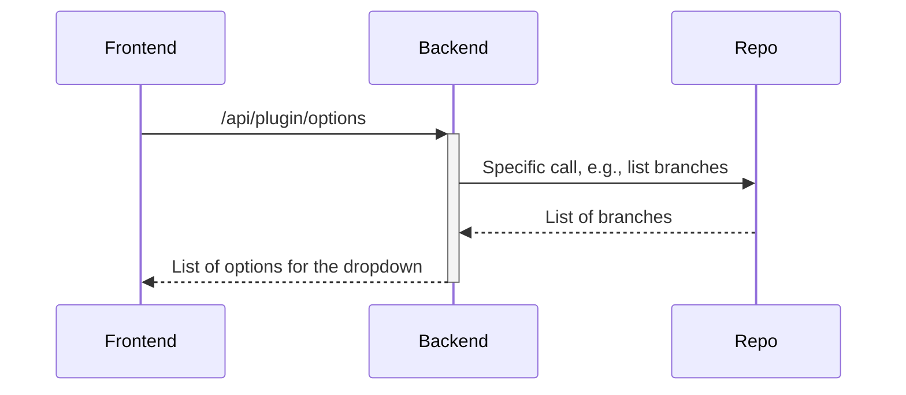
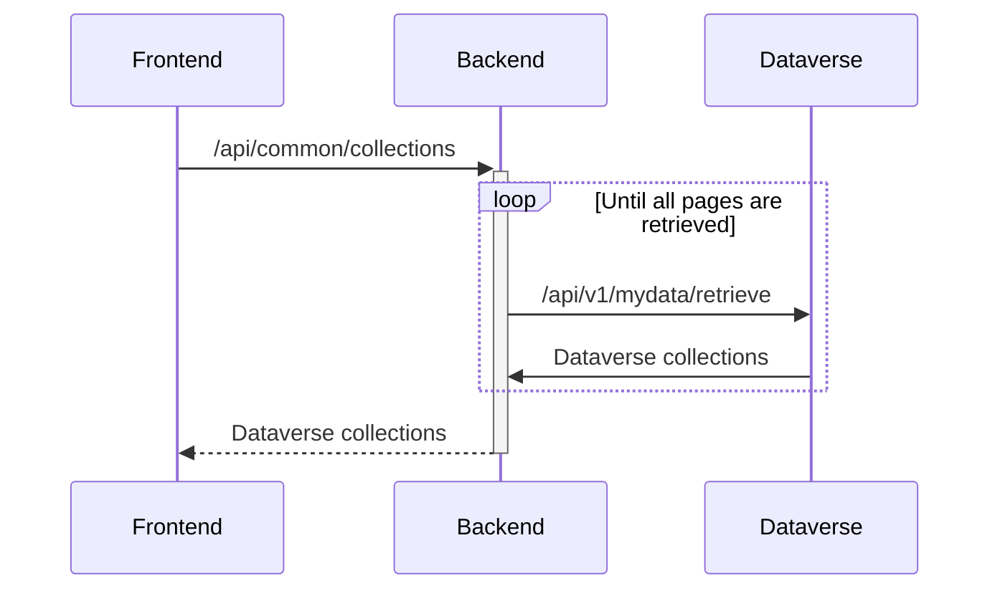
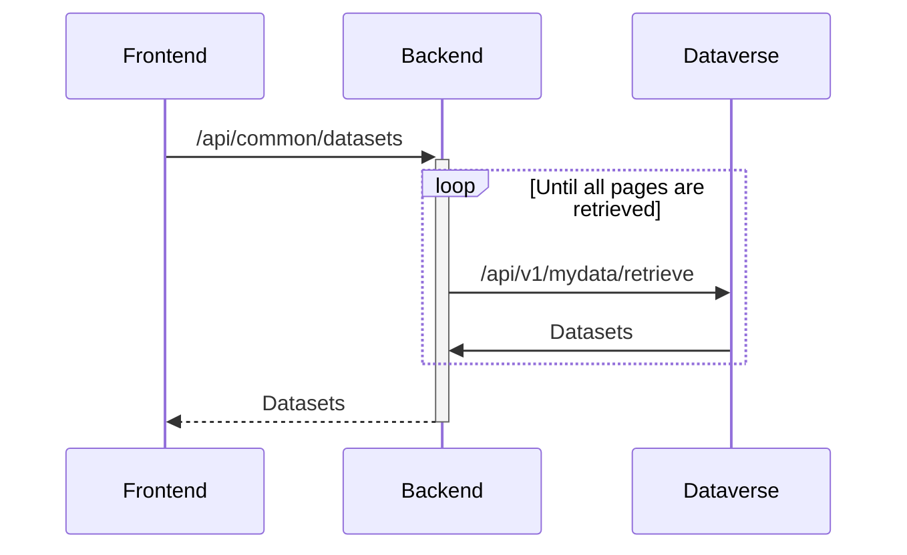
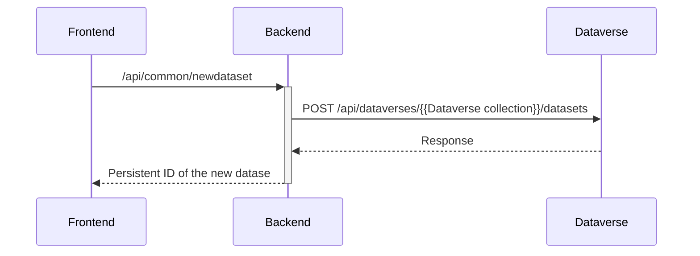
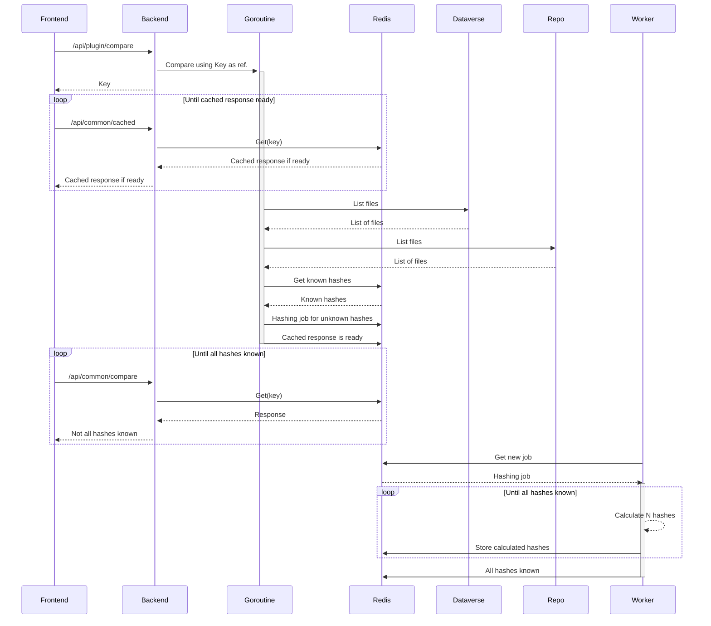

# Dataverse files synchronization application
This is an application for files synchronization from different source repositories into a [Dataverse](https://dataverse.org) installation. This application uses background processes for the synchronization of the files. The background processes are also used for hashing of the Dataverse files when the source repository uses different hash type than the Dataverse installation. The hashes are then used for the comparing of the files, allowing easier versioning of the files between the dataset versions (only the files that effectively have change would be replaced and added to the overview of changes between different dataset versions). The frontend application does not need to be running when the synchronization is running on the server (users can close their browsers once that the syncronization has been set up), and multiple synchronizations for different users can run simultaneously, each on its own go-routine, scheduled as a "job" in the background. The number of simultaniously running jobs is adjustable and the jobs are scheduled in First-In-First-Out (FIFO) order.

This application can also be used as a stand-alone tool for uploading and sychronizing files from local storage to the Dataverse installation.

## Prerequisites
For building the frontend, you need to have [Angular CLI](https://github.com/angular/angular-cli) installed. You will need to have the latest [Go](https://go.dev/) installed for compiling the code. If you wish to build the application's container, you will need to have the [Docker](https://www.docker.com) installed. For running and building the applications from source using the make commands, you will need to have [make](https://www.gnu.org/software/make/) installed. Finally, the state of the application (calculated hashes, scheduled jobs, etc.) is maintaind by a [Redis](https://redis.io/) data store. You will need either access to an external Redis server, or one run by you locally, when running this application on the server. The stand-alone tool does not require any Redis server (or any other tool or library installed on your system), and can be simply run by executing a binary built for your operating system.

## Dependencies
This application can be used by accessing the API directly (from cron jobs, etc.), or with a frontend providing GUI for the end users. The frontend ([rdm-integration-frontend](https://github.com/libis/rdm-integration-frontend)) needs to be checked out sparatly prior to building this application. Besides the frontend dependecy, the build process uses the following libraries and their dependencies (``go build`` command resolves them from ``go.mod`` and ``go.sum`` files and they do not need to be installad separately):
- [AWS SDK for Go](github.com/aws/aws-sdk-go)
- [Redis client for Go](github.com/go-redis/redis)
- [go-github](github.com/google/go-github)
- [uuid](github.com/google/uuid)
- [OAuth2 for Go](golang.org/x/oauth2)

## Running the application


### Running and building from source
In order to run the application locally, checkout in the same folder this repository ([rdm-integration](https://github.com/libis/rdm-integration)) and the frontend repository ([rdm-integration-frontend](https://github.com/libis/rdm-integration-frontend)). Then go to ``/rdm-integration`` directory and run ``make run``. This script will also start a docker container containing the Redis data store, which is used the by the running application for storing the application state. Notice that if you do not run standard Libis RDM (Dataverse) locally, you will need to configure the backend to connect to your Dataverse installation server. See the "Backend configuration" section for more detail.

You can also use make commands to build the docker image (``make build``) or push to the docker repository (``make push``). The resulting container can be used as a web server hosting the API and the frontend, or as container running the workers executing the jobs scheduled by the frontend. For the purpose of scallability, both types of intended usage can have multiple containers running behind a load balancer. The default run command starts a container performing both tasks: web server and a process controlling 100 workers:
```
docker run rdm/integration:1.0 app 100
```

If you wish to have different nuber of simultaniously running workes, change 100 to the desired values. If you only wish the resulting container to function as a webserver, change this command to the following:
```
docker run rdm/integration:1.0 app
```

When running the web server separately from the workers, you will need at least one container running the workers started with the following command:
```
docker run rdm/integration:1.0 workers 100
```

Building binaries with local filesystem plugin, just as the binaries included in the release, meant only for running by the end users and not on a server, is also done with the make command: ``make executable``. You may want to adjust that script by setting the variables to make the application connect to your Dataverse installation. By default the built application connects to the [Demo Dataverse](https://demo.dataverse.org). In order to change that you must adapt the build command the following way:
```
go build -ldflags "-X main.DataverseServer=https://demo.dataverse.org -X main.RootDataverseId=demo -X main.DefaultHash=MD5" -v -o datasync.exe ./app/local/
```

These are the ``-X`` flags that you can set at the build time:
- DataverseServer: URL of the Dataverse installation that the built application will connect to by default
- DataverseServerName: display name of the Dataverse installation, e.g., "Demo Dataverse"
- RootDataverseId: ID of the root Dataverse collection of the Dataverse installation, e.g., "demo"
- DefaultHash: most Dataverse installation use "MD5" as hashing algorithm and this flag can be ommited in most cases. The only hash that is supported right now is the "SHA1".
- MyDataRoleIds: this application uses the api call for retrieving "my data", for providing the user the choice of the dataset that the user wishes to update. However, this API requires the Role ID (primary key of the role table where the particular role is stored on the database), which can be tricky to find. Only the datasets where the user has that particular role are return by server. If your Dataverse installation does not fill the dropdown for dataset choice, then this flag should be adjusted. Otherwise, you can omit this flag. The default setting is ``6,7`` representing the ``contributor`` and ``curator`` roles on most installations.

You can also build the binaries for multiple architectures at once with the ``make multiplatform_demo`` command. Adapt the build commands in that script in a simmilar way as described for the ``make executable`` command.

### Backend configuration
The backend configuration is loaded by the application from a file specified by the path stored in the ``BACKEND_CONFIG_FILE`` environment variable. In order to set a value for that variable you will need to export that variable in the OS running the application, e.g.:
```
export BACKEND_CONFIG_FILE=../conf/backend_config.json
```

Note that the stand-alone version does not need the backend configuration file and is configured by the ``-X`` ldflags passed to the build command. You can also ovverride these flags by adding arguments to the execution command, as described above.

The only two required fileds that must be configured for the application to work are the following:
- dataverseServer: url of the server where Detaverse API is deployed
- redisHost: the host containing the Redis data store (storing the application state)

Additionally, the configuration can contain the following fields in the optional "options" field:
- dataverseExternalUrl: used to generate a link to the dataset presented to the user. Set this value if it is different from dataverseServer value, otherwise you can ommit it.
- rootDataverseId: root dataverse collection ID, needed for creating new dataset when no collection was chosen in the UI (fallback to root collection)
- defaultHash: as mentioned earlier, "MD5" is the default hash for most Dataverse installations. Change this only when your installation uses a different hashing algorithm (e.g., SHA-1)
- myDataRoleIds: role IDs for querying my data, as explained earlier in this section.
- pathToUnblockKey: path to the file containing the API unblock key. Configure this value to enable checking permissions before requesting jobs
- pathToRedisPassword: by default no password is set, if you need to authenticate, store here the path to the file containing the redis password
- redisDB: by default DB 0 is used. If you need to use other DB, specify it here
- defaultDriver: default driver as used by the dataverse installation, only "file" and "s3" are supported. See also the next section.
- pathToFilesDir: path to the folder where dataverse files are stored (only needed when using the "file" driver)
- s3Config: configuration when using the "s3" driver, set in simmilar fassion to the settings for the s3 driver in your Dataverse installation. Only needed when using S3 filesystem that is not mounted as a volume. See also the next section.

### Dataverse filesystem drivers
When running this tool on the server, you can take atvantage of directly uploading files to the filesystem where Dataverse files are stored, assuming that you have direct access to that filesystem from the location where this application is running. Most generic way is simply mounting the filesystem as volume and configuring the tool to use the "file" driver pointing to the mounted volume. This works well for native filesystems as well as other remote filesystems. For example, you can use (AWS or locally deployed) S3 filesystem by first mounting a bucket with [s3fs](https://github.com/s3fs-fuse/s3fs-fuse). You can do that either on the host system where the application is running, on the container where application is running (e.g., you can use the [s3fs-fuse](https://pkgs.alpinelinux.org/package/edge/testing/x86/s3fs-fuse) package for the Alpine linux that the Docker image is based on), or use separate Docker container that mounts the volume and makes it available to other docker containers (e.g. [efrecon/s3fs](https://hub.docker.com/r/efrecon/s3fs)). There are other countless examples of mounting different native or remote filesystems as a volume. All of them are configured in a simmilar way, for example:

```
{
    "dataverseServer": "https://some.dataverse.com",
    "redisHost": "localhost:6379",
    "options": {
        "dataverseServer": "https://some.dataverse.com",
        "defaultDriver": "file",
        "pathToFilesDir": "/path/to/mounted/volume"
    }
}
```

As an alternative, you can access an s3 storage directly from this application, without the need of mounting it. First, you will need to configure the authentication by setting the following environment variables on the OS running this application:
- Access Key ID: ``AWS_ACCESS_KEY_ID`` or ``AWS_ACCESS_KEY``
- Secret Access Key: ``AWS_SECRET_ACCESS_KEY`` or ``AWS_SECRET_KEY``

The s3 driver is then further configured in the ``backend_config.json``, for example (copy the setting values from your Datavarse installation):
```
{
    "dataverseServer": "localhost:8080",
    "redisHost": "localhost:6379",
    "options": {
        "dataverseExternalUrl": "https://demo.dataverse.org",
        "defaultDriver": "s3",
        "s3Config": {
            "awsEndpoint": "http://some.endpoint.here",
            "awsRegion": "region",
            "awsPathstyle": "true",
            "awsBucket": "bucket"
        }
    }
}
```

Notice that the driver configuration is optional. When it is not set, no direct uploading is in use and simply the Dataverse API is called for storing the files. However, this can result in unnecessary usage of resources (network, cpu, etc.) and might slow down the Dataverse installation.

### Frontend configuration
frontend_config.json, header.hml and footer.html

## Writting a new plugin
In order to integrate a new repository type, you need to implement a new plugin for the backend. The plugins are implemented in the /image/app/plugin/impl folder (each having its own package). The new plugin implementation must be then registered in the /image/app/plugin/registry.go file. As can be seen in the same file, a plugin implements functions that are required by the Plugin type:
```
type Plugin struct {
	Query   func(req types.CompareRequest) (map[string]tree.Node, error)
	Options func(params types.OptionsRequest) ([]string, error)
	Streams func(ctx context.Context, in map[string]tree.Node, streamParams types.StreamParams) (map[string]types.Stream, error)
}
```

Note that the Plugin type is a struct and cannot hold any state, as it has no fields. Therefore, the plugin implementations are stateless and all state, caching, etc., are handled by the application, independently of the used plugin. This makes the plugins easier to implement. Each plugin implements these tree functions:
- Query: using the standard fields as provided in the "types.CompareRequest" (username, api token, URL, etc.) this function queries the repository for files. The result is a flat mapping of files found on the repository to their paths. A file is represented by a "tree.Node" type containing the file name, file path, hash type and hash value, etc. Notice that it does not contain the file itself.
- Options: this function lists branches (or folders in the case of IRODS, this is also the reason for choosing a more generic name "options" i.s.o. "branches") applicable for the current repository. It can be only called when the user has provided the credentials needed to call the repository (this is verified at frontend). These credentials are then provided in the "types.OptionsRequest" value.
- Streams: files are synchronized using streams from the source repository to the filesystem, where each file has its own stream. This function implements "types.Stream" objects for the provided files (the "in" parameter contains a filtered list of files that are going to be copied from the repository). Notably, a "types.Stream" object contains a function for opening a stream to the provided file and a function to close that stream.

After implementing the above-mentioned functions on the backend, you need to extend the frontend (https://github.com/libis/rdm-integration-frontend) by adding a frontend plugin in "plugin.service.ts". This is a straight forward implementation of the RepoPlugin type as defined in the "plugin.ts" model. It basically tells the frontend that there is a new repository type, which fields should be shown on the connect page and how these fields should be named, etc., for the given repository type.

## Sequence diagrams

### Get options
Listing branches, folders, etc. (depending on the repo plugin) that can be chosen in dropdown and on the connect page is a synchronous call. When retrieved, a branch or folder can be selected by the user as reference from where the files will be synchronized. The listing itself is implemented by a plugin and is described in the following sequence diagram:



### Get dataverse collections



### Get datasets
Another dropdown on the connect page lets the user to specify to which dataset the files should be synchronized. This is also a synchronous call and the dropdown displays "Loading..." (the same is true for the get options call) until a response is recived from the backend. The backend uses the Dataverse /api/v1/mydata/retrieve api call and retrieves all pages in a loop (the call supports paging for the cases where the user has many datasets). This is depicted in the diagram below:



### Create new dataset
When a user wishes to synchronize the files to a new (not yet existing) dataset, the frontend provides an option of creating a new incomplete dataset. The newly created dataset has a minimal metadata that does is not valid. After the synchronization (in this case simply an upload from the source repository to the new dataset) is complete, the user is presented with a link to this dataset on the Dataverse installation where the datset was created. The user can then complete the metadata and make the new dataset valid and ready for review or publication.

The frontend needs to provide two parameters before the call to the backend can be made: a Dataverse application token proving the identity of the user (and proving that the user has permission to create new datasets), and optional Dataverse collection (depicted as "{{Datavere collection}}" path parameter in the sequence diagram below). When the collection is not provided (e.g., the collection selection is disabled in the frontend for the Libis RDM Dataverse installation), the default collection configured in the backend is used.



### Compare files




### Store changes
/api/common/store
