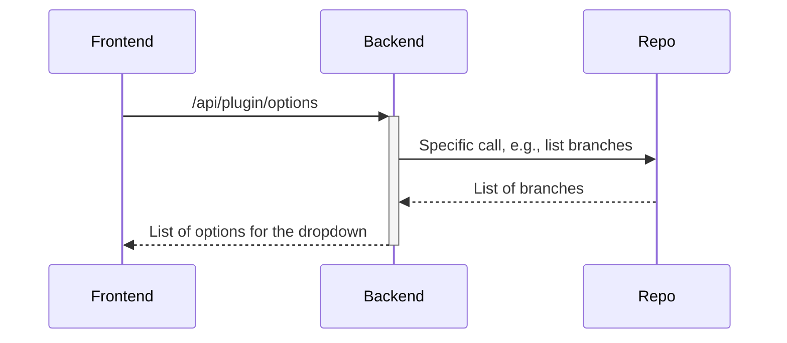
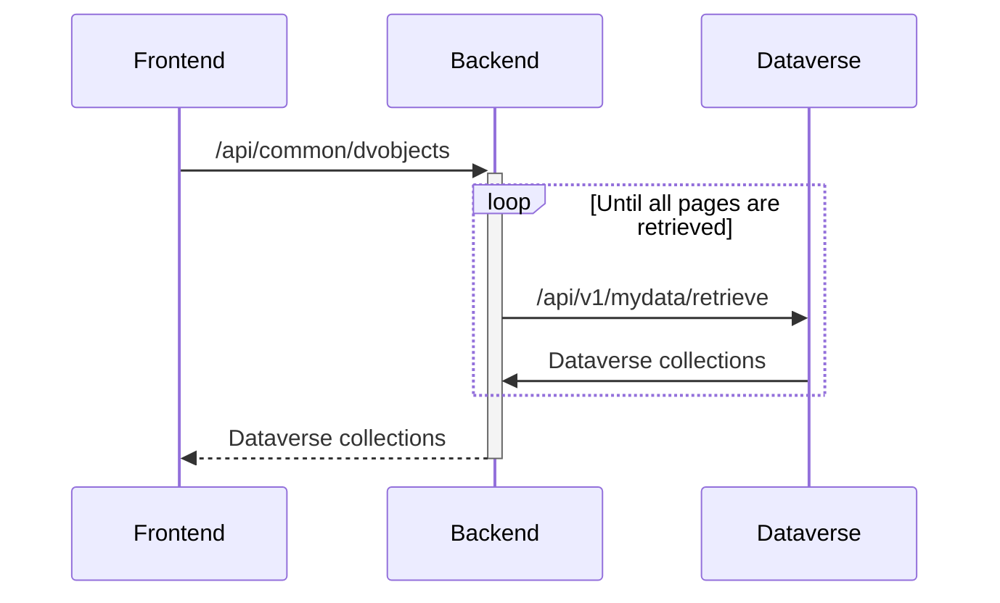
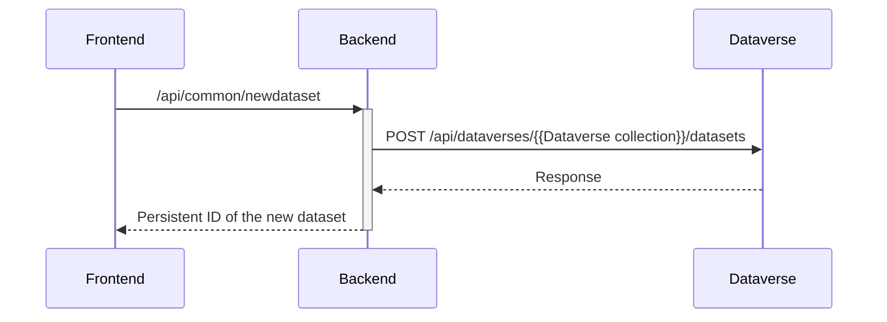
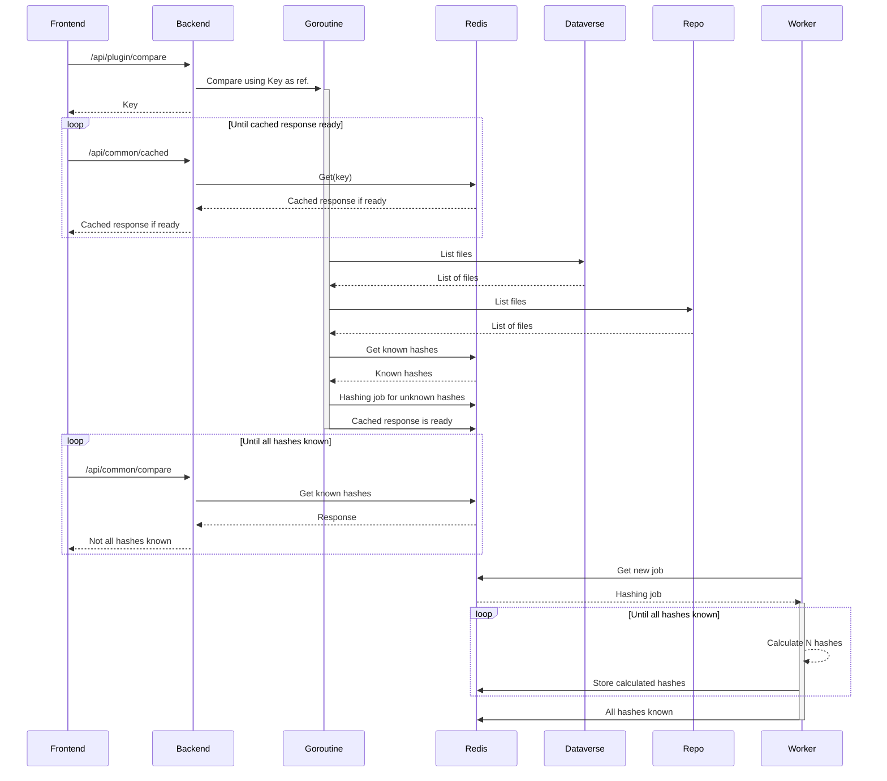
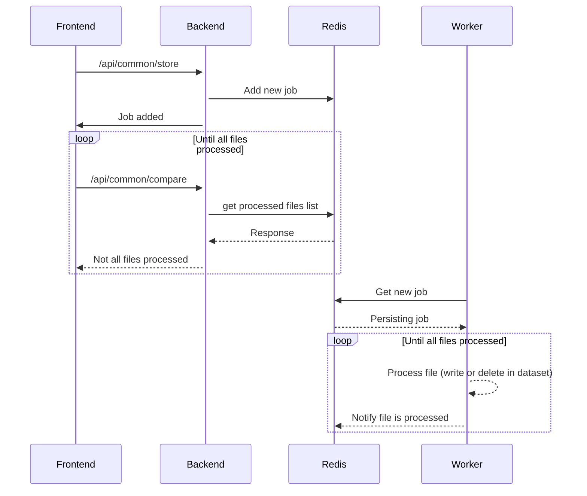

# rdm-integration

> A powerful application for synchronizing files from various source repositories into Dataverse, with support for background processing, DDI-CDI metadata generation, and high-performance Globus transfers.


## 📋 Table of Contents

- [Overview](#overview)
- [Key Features](#key-features)
- [Quick Start](#quick-start)
- [Available Plugins](#available-plugins)
- [Configuration](#configuration)
  - [Backend Configuration](#backend-configuration)
  - [Frontend Configuration](#frontend-configuration)
- [Documentation](#documentation)
- [Development](#development)
  - [Prerequisites](#prerequisites)
  - [Dependencies](#dependencies)
  - [Fast Redeploy](#fast-redeploy)
  - [Writing a New Plugin](#writing-a-new-plugin)
- [Architecture](#architecture)
- [Appendix](#appendix)
  - [Sequence Diagrams](#sequence-diagrams)

[↑ Back to Top](#rdm-integration)

---

## Overview

This application enables seamless file synchronization from different source repositories into [Dataverse](https://dataverse.org) installations. It uses background processes for file synchronization and hash verification, allowing easier version tracking between dataset versions.

**Key capabilities:**
- Background job processing with concurrent goroutines
- Multiple simultaneous users supported
- Configurable job scheduling (First In First Out)
- No need for frontend to remain open during synchronization
- Hash verification for file comparison and versioning

[↑ Back to Top](#rdm-integration) | [→ Quick Start](#quick-start)

---

## Key Features

### 🔄 Data Synchronization
Synchronize files from various repositories into Dataverse with background processing, hash verification, and version tracking.

### 📊 DDI-CDI Metadata Generation
Automatically generate rich, standardized metadata descriptions for your tabular data files following the DDI-CDI (Data Documentation Initiative - Cross-Domain Integration) specification. Analyzes CSV, TSV, SPSS, SAS, and Stata files to create comprehensive documentation.

**Learn more:** [ddi-cdi.md](ddi-cdi.md)

### ⚡ High-Performance Globus Transfers
Move data reliably and at scale using Globus. Built-in Globus plugin supports both uploads and downloads via managed Globus transfers for S3-backed storage, with real-time progress monitoring and institutional endpoint access.

**Learn more:** [GLOBUS_INTEGRATION.md](GLOBUS_INTEGRATION.md)

[↑ Back to Top](#rdm-integration) | [→ Quick Start](#quick-start)

---

## Quick Start

**Prerequisites:** Docker (with Compose plugin) and GNU Make installed.

```bash
# Start the full demo stack
make up
```

Once services are up, you can access:

- **Web app:** http://localhost:4180
- **DDI-CDI generator:** http://localhost:4180/ddi-cdi
- **Globus download:** http://localhost:4180/download
- **Dataverse UI:** http://localhost:8080
- **Keycloak admin:** http://localhost:8090 (realm: `test`, user: `kcadmin` / `kcpassword`)

### Default Credentials

- **Application/Dataverse OIDC login:** `admin` / `admin`
- **Keycloak admin console:** `kcadmin` / `kcpassword`
- **Dataverse built-in admin:** username `dataverseAdmin`, password in `docker-volumes/dataverse/secrets/password`
- **Dataverse built-in admin API key:** `/run/secrets/api/adminkey` (inside the Dataverse container)

### Using from Dataverse

1. Open http://localhost:8080 and log in via OpenID Connect
2. Sign in with `admin` / `admin`
3. Complete the new user form
4. Create an API token via the menu
5. Create a new dataset
6. Choose "RDM-integration upload" from the "Edit Dataset" menu

The stack auto-registers three external tools:
- **RDM-integration download** (`/download`) — Globus download component
- **RDM-integration upload** (`/connect`) — Connect/sync workflow
- **Generate DDI-CDI** (`/ddi-cdi`) — DDI-CDI metadata generator

Configurations live in `conf/dataverse/external-tools/`.

Tool configuration files:
- `conf/dataverse/external-tools/01-rdm-integration-download.json`
- `conf/dataverse/external-tools/02-rdm-integration-upload.json`
- `conf/dataverse/external-tools/03-rdm-integration-ddi-cdi.json`

### Stop and Reset

```bash
# Stop the stack
make down

# Reset local volumes and re-initialize
make clean
make init
```

[↑ Back to Top](#rdm-integration) | [→ Available Plugins](#available-plugins)

---

## Available Plugins

Support for different repositories is implemented as plugins:

| Plugin | Description |
|--------|-------------|
| **GitHub** | Sync from GitHub repositories |
| **GitLab** | Sync from GitLab repositories |
| **IRODS** | Sync from IRODS data management systems |
| **Dataverse** | Import data from other Dataverse installations |
| **OneDrive / SharePoint** | Microsoft Graph integration (same plugin, configured differently) |
| **OSF** | Open Science Framework integration |
| **SFTP** | SSH File Transfer Protocol support |
| **REDCap** | Research Electronic Data Capture integration |
| **Globus** | Upload and download using Globus transfers (S3-backed storage) |
| **Local Filesystem** | Sync from local folders accessible to the server |

[↑ Back to Top](#rdm-integration) | [→ Configuration](#configuration)

---

## Configuration

The application loads runtime configuration from two files via environment variables:

- **Backend:** `BACKEND_CONFIG_FILE` → `/config/backend_config.json`
- **Frontend:** `FRONTEND_CONFIG_FILE` → `/config/frontend_config.json`

Source templates live in `conf/`:
- `conf/backend_config.json`
- `conf/frontend_config.json`

The `make init` target copies these to `docker-volumes/integration/conf/`, which is mounted into containers by `docker-compose.yml`.

To customize: edit files in `conf/` and run `make init` (fresh volumes), or modify copies in `docker-volumes/integration/conf/` and restart (`make down && make up`).

[↑ Back to Top](#rdm-integration)

### Backend Configuration

The backend configuration is loaded from the file specified by the `BACKEND_CONFIG_FILE` environment variable.

**Example:**
```bash
export BACKEND_CONFIG_FILE=../conf/backend_config.json
```

**Mandatory fields:**
- `dataverseServer`: URL of the Dataverse API server
- `redisHost`: Redis data store host (storing application state)

**Optional fields in the "options" section:**

| Field | Description |
|-------|-------------|
| `dataverseExternalUrl` | Link to dataset for UI (if different from dataverseServer) |
| `rootDataverseId` | Root collection ID for creating datasets |
| `defaultHash` | Hash algorithm (default: MD5; change to SHA-1 if needed) |
| `myDataRoleIds` | Role IDs for querying "my data" |
| `pathToUnblockKey` | Path to API unblock key file |
| `pathToApiKey` | Path to admin API key file (enables URL signing) |
| `pathToRedisPassword` | Path to Redis password file |
| `redisDB` | Redis database number (default: 0) |
| `defaultDriver` | Default file driver: "file" or "s3" |
| `pathToFilesDir` | Path to Dataverse files folder (file driver only) |
| `s3Config` | S3 configuration object (s3 driver only) |
| `pathToOauthSecrets` | Path to OAuth client secrets file |
| `maxFileSize` | Maximum upload file size (0 = unlimited) |
| `userHeaderName` | Header containing username for URL signing (default: "Ajp_uid") |
| `smtpConfig` | SMTP configuration for email notifications |
| `pathToSmtpPassword` | Path to SMTP password file |

**Example backend configuration:** [conf/backend_config.json](conf/backend_config.json)
**Demo Dataverse example:** [conf/backend_config_demo.json](conf/backend_config_demo.json)

**Dataverse File System Drivers**

The application can directly upload files to the Dataverse file system. Two drivers are supported:

**File Driver** (mounted volume):
```json
{
  "dataverseServer": "https://some.dataverse.com",
  "redisHost": "localhost:6379",
  "options": {
    "defaultDriver": "file",
    "pathToFilesDir": "/path/to/mounted/volume"
  }
}
```

**S3 Driver** (direct S3 access):

First, set environment variables:
- `AWS_ACCESS_KEY_ID` or `AWS_ACCESS_KEY`
- `AWS_SECRET_ACCESS_KEY` or `AWS_SECRET_KEY`

Then configure:
```json
{
  "dataverseServer": "localhost:8080",
  "redisHost": "localhost:6379",
  "options": {
    "defaultDriver": "s3",
    "s3Config": {
      "awsEndpoint": "http://some.endpoint.here",
      "awsRegion": "region",
      "awsPathstyle": "true",
      "awsBucket": "bucket"
    }
  }
}
```

**Note:** Driver configuration is optional. Without it, the Dataverse API is used for file storage (may consume more resources).

[↑ Back to Top](#rdm-integration) | [→ Frontend Configuration](#frontend-configuration)

### Frontend Configuration

Two types of customizations are available:

#### 1. HTML File Replacement

Place custom HTML files in `conf/customizations/` (e.g., [footer.html](conf/customizations/assets/html/footer.html), [header.html](conf/customizations/assets/html/header.html)). To enable:

```bash
cp -r conf/customizations/* image/app/frontend/dist/datasync/
```

#### 2. Configuration File

Default: [image/app/frontend/default_frontend_config.json](image/app/frontend/default_frontend_config.json)
Custom: Set `FRONTEND_CONFIG_FILE` environment variable
Example: [conf/frontend_config.json](conf/frontend_config.json)

**Available options:**

| Field | Description |
|-------|-------------|
| `dataverseHeader` | Display name of the Dataverse installation |
| `collectionOptionsHidden` | Show/hide collection dropdown (default: false = shown) |
| `collectionFieldEditable` | Allow direct typing of collection IDs |
| `createNewDatasetEnabled` | Enable "Create new dataset" button |
| `datasetFieldEditable` | Allow direct typing of DOI identifiers |
| `externalURL` | Filled by backend from configuration |
| `showDvTokenGetter` | Show "Get token" button |
| `showDvToken` | Show token field (false when using URL signing) |
| `redirect_uri` | OAuth redirect URI pointing to `/connect` |
| `sendMails` | Enable email notifications |
| `plugins` | Array of repository instance configurations |

**Plugin Instance Configuration:**

Each entry in `plugins` can contain:

| Field | Description |
|-------|-------------|
| `id` | Unique identifier for the repository instance |
| `name` | Instance name shown in UI |
| `plugin` | Plugin identifier from [registry.go](image/app/plugin/registry.go) |
| `pluginName` | Display name in "Repository type" dropdown |
| `optionFieldName` | Name for option field (e.g., "branch", "folder") |
| `tokenFieldName` | Name for token/password field |
| `sourceUrlFieldName` | Source URL field name (if applicable) |
| `sourceUrlFieldValue` | Default source URL value |
| `usernameFieldName` | Username field name (if applicable) |
| `repoNameFieldName` | Repository selection field name |
| `repoNameFieldEditable` | Allow direct typing |
| `repoNameFieldValues` | Suggested repository names |
| `repoNameFieldHasSearch` | Enable search functionality |
| `repoNameFieldHasInit` | Enable initial search |
| `parseSourceUrlField` | Parse repo name from source URL |
| `tokenName` | Unique name for credential storage |
| `tokenGetter` | OAuth configuration object |

Additional supported fields:

| Field | Description |
|-------|-------------|
| `optionFieldPlaceholder` | Placeholder for option selector |
| `tokenFieldPlaceholder` | Placeholder for token/password input |
| `sourceUrlFieldPlaceholder` | Placeholder for source URL input |
| `usernameFieldPlaceholder` | Placeholder for username input |
| `repoNameFieldPlaceholder` | Placeholder for repository selector/input |

[↑ Back to Top](#rdm-integration) | [→ Documentation](#documentation)

---

## Documentation

Comprehensive guides are available for specific features:

### Feature Documentation

| Document | Description |
|----------|-------------|
| [ddi-cdi.md](ddi-cdi.md) | Complete guide to DDI-CDI metadata generation |
| [GLOBUS_INTEGRATION.md](GLOBUS_INTEGRATION.md) | Globus transfer features, configuration, and comparison |
| [preview_urls.md](preview_urls.md) | Preview URL support for Globus downloads |
| [DOWNLOAD_FILTERING.md](DOWNLOAD_FILTERING.md) | How the download UI filters datasets by user permissions |

### Development Documentation

| Document | Description |
|----------|-------------|
| [FAST_REDEPLOY.md](FAST_REDEPLOY.md) | Quick redeploy workflow for development |

[↑ Back to Top](#rdm-integration) | [→ Development](#development)

---

## Development

[↑ Back to Top](#rdm-integration)

### Prerequisites

**Required for building:**
- [Angular CLI](https://github.com/angular/angular-cli) — Frontend build
- [Go](https://go.dev/) — Latest version for backend
- [Docker](https://www.docker.com) — Container builds
- [Redis](https://redis.io/) — State management (or external Redis server)

**Note:** The stand-alone tool does not require Redis or other dependencies.

[↑ Back to Top](#rdm-integration) | [→ Dependencies](#dependencies)

### Dependencies

**Frontend:**
- [rdm-integration-frontend](https://github.com/libis/rdm-integration-frontend) (Angular application)

**Backend Go libraries** (resolved automatically via `go build` from `go.mod`):
- [AWS SDK for Go v2](https://github.com/aws/aws-sdk-go-v2)
- [Redis client for Go](https://github.com/go-redis/redis)
- [go-github](https://github.com/google/go-github)
- [uuid](https://github.com/google/uuid)
- [OAuth2 for Go](https://golang.org/x/oauth2)

[↑ Back to Top](#rdm-integration) | [→ Fast Redeploy](#fast-redeploy)

### Fast Redeploy

When working with the development stack (`make dev_up`), you can rebuild individual services without full stack teardown:

```bash
make dev_up           # Start dev stack once
make frd-integration  # Quick backend/frontend redeploy
make frd-dataverse    # When Dataverse code changes
```

**Requirements:**
- Clone sibling repositories: `../dataverse`, `../rdm-integration-frontend`
- Keep dev stack running
- Frontend changes auto-reload via `ng serve`

**Full guide:** [FAST_REDEPLOY.md](FAST_REDEPLOY.md)

[↑ Back to Top](#rdm-integration) | [→ Writing a New Plugin](#writing-a-new-plugin)

### Writing a New Plugin

To integrate a new repository type, implement a backend plugin.

**Steps:**

1. Create implementation in `image/app/plugin/impl/<plugin-name>/`
2. Register in [registry.go](image/app/plugin/registry.go)
3. Implement required functions:

```go
type Plugin struct {
    Query   func(ctx context.Context, req types.CompareRequest, dvNodes map[string]tree.Node) (map[string]tree.Node, error)
    Options func(ctx context.Context, params types.OptionsRequest) ([]string, error)
    Search  func(ctx context.Context, params types.OptionsRequest) ([]string, error)
    Streams func(ctx context.Context, in map[string]tree.Node, streamParams types.StreamParams) (map[string]types.Stream, error)
}
```

**Required functions:**

- **Query**: Query the repository for files, return mapping of files to paths
  - Input: `types.CompareRequest` (credentials, URL, etc.) + existing Dataverse nodes
  - Output: Map of file paths to `tree.Node` objects (filename, hash, etc.)

- **Streams**: Create streams for file synchronization
  - Input: Filtered list of files to copy + stream parameters
  - Output: Map of file paths to `types.Stream` objects (open/close functions)

**Optional functions:**

- **Options**: List branches/folders for the repository
  - Input: `types.OptionsRequest` (credentials, repo name)
  - Output: List of option strings

- **Search**: Search repositories by name
  - Input: Search term from user
  - Output: List of repository names

**After backend implementation:** Configure the plugin in the frontend (see [Frontend Configuration](#frontend-configuration))

[↑ Back to Top](#rdm-integration) | [→ Architecture](#architecture)

---

## Architecture


**Core components:**

- **Go Backend**: Job orchestration, plugin registry, authentication, file system access
- **Redis**: Job queue and state management
- **Workers**: Background goroutines for file processing and hash calculation
- **Frontend (Angular)**: User interface and workflow management
- **Dataverse API**: Dataset operations and file management
- **Repository Plugins**: Modular connectors for various data sources

**Key workflows:** See [Sequence Diagrams](#sequence-diagrams)

[↑ Back to Top](#rdm-integration) | [→ Appendix](#appendix)

---

## Appendix

[↑ Back to Top](#rdm-integration)

### Sequence Diagrams

#### Get Options
The sequence diagrams for `search` and `oauthtoken` are very similar to this one.



[↑ Back to Top](#rdm-integration)

#### Get Dataverse Objects



[↑ Back to Top](#rdm-integration)

#### Create New Dataset



[↑ Back to Top](#rdm-integration)

#### Compare Files



[↑ Back to Top](#rdm-integration)

#### Store Changes



[↑ Back to Top](#rdm-integration)

---

## License

This project is licensed under the Apache License, Version 2.0. See [LICENSE.txt](LICENSE.txt) for details.

---

[↑ Back to Top](#rdm-integration)
